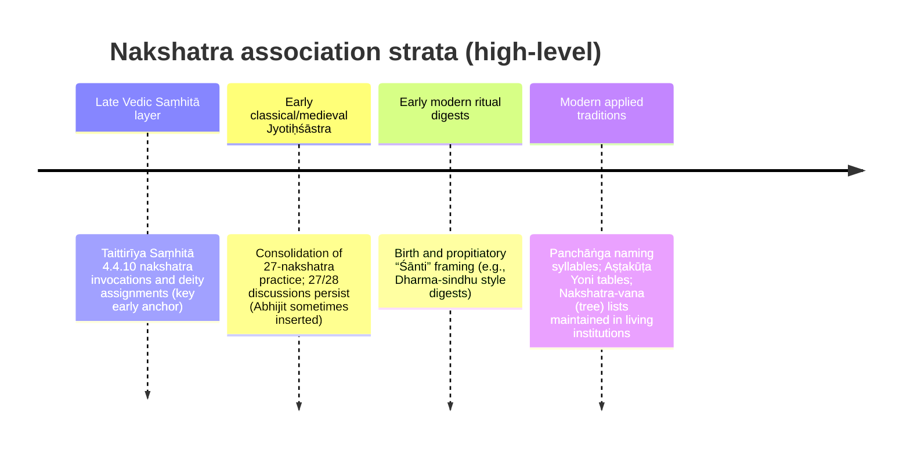

# Documented Associations of the Vedic Nakshatras

## Executive summary

The **27-nakshatra** lunar mansion system is widely attested in late Vedic and post‑Vedic literature and is foundational to later **Jyotiḥśāstra** (astral science). A key technical difficulty in “documenting associations” is that **different kinds of associations arise in different source strata**: (a) **deity assignments** (devatā) are old and strongly textual; (b) **ritual usage** is often generic (nakshatra mantras/offerings used for timing and propitiation) and appears in Vedic and later ritual digests; (c) **plant (tree) assignments** (nakshatra‑vṛkṣa / nakshatra‑vana) are **much later and regionally variable**, typically documented as living traditions and modern compendia rather than securely in Vedic Saṃhitās; (d) **sound associations** in mainstream usage are the **pada name‑syllables** used for naming (nāmakaraṇa) and appear in practical almanac traditions (panchāṅga) and later handbooks; (e) **animal associations** are most consistently documented as **Yoni (animal) classifications** used in **Aṣṭakūṭa** marriage matching traditions. The corpus itself also preserves a persistent “**27 vs 28**” tension: the sky has ~27.3 sidereal lunar days, but customary practice often standardizes to 27; some traditions insert **Abhijit** as a 28th asterism. citeturn46search0  

In the relation lines below, I provide for each nakshatra: (1) presiding deity; (2) associated plant (explicitly noting when this is a **late nakshatra‑vana tradition**); (3) ritual use (as a **Vedic nakshatra‑invocation/propitiation** anchor plus a widely used **birth/propitiation** framing); (4) associated sound (the conventional **pada syllables**); and (5) associated animal (the conventional **Yoni animal** used in matching). Where an attribute cannot be responsibly treated as textually attested in the surveyed strata, it is marked **unspecified**.

## Method and source chronology

### How “attestation” is handled

The user request combines **very early textual layers** (Vedas and Brāhmaṇas) with **classical encyclopedic astrology** (e.g., Varāhamihira) and with **applied living traditions** (naming syllables, nakshatra trees, marriage‑matching yonis). These do not behave the same way as evidence. I therefore treat “attested” as one of two kinds:

* **Textual attestation:** a mapping appears in a text tradition (with a stable reference location such as kāṇḍa/anuvāka/verse, chapter/verse, or clearly cited table).  
* **Ethnographic / practice attestation:** a mapping is clearly present as a documented and reproducible tradition (e.g., nakshatra‑vana plant lists; panchāṅga syllables; Aṣṭakūṭa yoni tables), even if the tradition’s *earliest* Sanskrit textual locus is unclear or disputed.

### Mermaid chronology sketch

Key chronological guardrails used here: the “27–28” custom and the note that a list of nakshatras is first found in the **Vedāṅga Jyotiṣa** (dated in the “final centuries BCE” in a common summary), and that later astronomical influences become prevalent from around the 2nd century CE—useful context for why association-systems diversify and standardize over time. citeturn46search0  

## What the sources actually support

### Presiding deities are the strongest textual association

A durable early anchor is the Vedic nakshatra invocation material in the **Taittirīya Saṃhitā (Black Yajurveda)**, which explicitly pairs nakshatra-names with deities in a ritual context (“X the nakshatra; Y the deity; I invoke…”). The translation tradition also notes variant identifications and nomenclature issues (e.g., second “Rohiṇī” glossed as **Jyeṣṭhā**, and **Tiṣya** as **Puṣya** in glossing), a reminder that mapping Vedic lists into later standardized 27-name inventories requires care. citeturn25view2  

### Ritual use is often “generic but real”

The same Vedic pairing material is itself evidence of nakshatras functioning as **ritually addressable powers** (invoked/propitiated), which supports a conservative “ritual_use” association: **nakshatra‑propitiation / nakshatra mantra use** rather than speculative, highly specific rites for each mansion. citeturn25view2  

Separately, early‑modern dharma digests document applied “nakshatra śānti” logic for births under inauspicious configurations (e.g., specific warnings tied to particular padas of Māgha, Jyeṣṭhā, Aśleṣā, Mūla). This does **not** provide a neat one‑to‑one ritual per nakshatra, but it does show live ritual causality assigned to nakshatra conditions. citeturn32search8  

### Plants, sounds, and animals are mainly “applied tradition” associations

* **Plants (nakshatra‑vṛkṣa):** widely circulated lists exist (often embedded in “nakshatra‑vana” institutions), but the **earliest textual locus** is frequently asserted rather than demonstrated. To avoid inventing a false Vedic pedigree, the plant links below are treated as **late, practice‑attested** associations (with explicit sourcing). citeturn53search0turn33search4  
* **Sounds:** the nakshatra–pada syllable table is a standard panchāṅga convention and is explicitly laid out in the “Padas (quarters)” table for the 27 nakshatras. citeturn46search0  
* **Animals (Yoni):** Aṣṭakūṭa matching systems classify nakshatras into 14 animal yonis; the table evidence is clear in modern explanatory sources even when the earliest ślokas are not foregrounded. citeturn44search3turn49search0  

## Relation lines for the Nakshatras

**Source key used in the “source” field** (to keep every line in the requested exact format):  
Presiding deity + Vedic ritual anchor: **Taittirīya Saṃhitā 4.4.10 (Keith, trans.)**. citeturn25view2  
Sound syllables (pada naming): **“List of Nakshatras” → “Padas (quarters)” table**. citeturn46search0  
Animal yoni table: **Yoni classification table (modern Aṣṭakūṭa convention)**. citeturn44search3turn49search0  
Plant (nakshatra‑vṛkṣa): treated as **late nakshatra‑vana / nakshatra‑vṛkṣa tradition**, documented via compiled lists. citeturn33search4turn53search0  

ENTITY: Ashwini  
RELATIONS  
Ashwini | presiding_deity | Ashvins (Aśvinau) | Taittirīya Saṃhitā 4.4.10 (Keith, trans.; Aśvayujau/Aśvinau); devatā pairing citeturn25view2  
Ashwini | associated_plant | Kuchala / Kanjiram (Strychnos nux‑vomica) | Nakshatravana / nakshatra‑vṛkṣa tradition list (Sringeri-type compiled list) citeturn53search0  
Ashwini | ritual_use | Nakshatra invocation/propitiation (Vedic nakshatra mantra/oblation framework) | Taittirīya Saṃhitā 4.4.10 nakshatra invocations citeturn25view2  
Ashwini | associated_sound_or_raga | Chu / Che / Cho / La | “List of Nakshatras” (pada syllables table) citeturn46search0  
Ashwini | associated_animal | Horse (Aśva yoni) | Yoni table (Aṣṭakūṭa matching convention) citeturn44search3turn49search0  

ENTITY: Bharani  
RELATIONS  
Bharani | presiding_deity | Yama | Taittirīya Saṃhitā 4.4.10 (Keith, trans.; Apabharaṇī/Yama) citeturn25view2  
Bharani | associated_plant | Amla / Amalaki (Phyllanthus emblica) | Nakshatravana / nakshatra‑vṛkṣa tradition list citeturn53search0  
Bharani | ritual_use | Nakshatra invocation/propitiation (Vedic nakshatra mantra/oblation framework) | Taittirīya Saṃhitā 4.4.10 citeturn25view2  
Bharani | associated_sound_or_raga | Li / Lu / Le / Lo | “List of Nakshatras” (pada syllables table) citeturn46search0  
Bharani | associated_animal | Elephant (Gaja yoni) | Yoni table citeturn44search3  

ENTITY: Krittika  
RELATIONS  
Krittika | presiding_deity | Agni | Taittirīya Saṃhitā 4.4.10 (Keith, trans.; Kṛttikā/Agni) citeturn25view2  
Krittika | associated_plant | Udumbara / Gular (Ficus racemosa) | Nakshatra‑vṛkṣa list (compiled tradition) citeturn33search4turn53search0  
Krittika | ritual_use | Nakshatra invocation/propitiation | Taittirīya Saṃhitā 4.4.10 citeturn25view2  
Krittika | associated_sound_or_raga | A / I / U / E | “List of Nakshatras” (pada syllables table) citeturn46search0  
Krittika | associated_animal | Sheep (Mesha yoni) | Yoni table citeturn44search3  

ENTITY: Rohini  
RELATIONS  
Rohini | presiding_deity | Prajāpati (often glossed as Brahmā/Prajāpati) | Taittirīya Saṃhitā 4.4.10 (Keith, trans.; Rohiṇī/Prajāpati) citeturn25view2  
Rohini | associated_plant | Jambu / Jamun (Syzygium cumini) | Nakshatra‑vṛkṣa list (compiled tradition) citeturn33search4turn53search0  
Rohini | ritual_use | Nakshatra invocation/propitiation | Taittirīya Saṃhitā 4.4.10 citeturn25view2  
Rohini | associated_sound_or_raga | O / Va / Vi / Vu | “List of Nakshatras” (pada syllables table) citeturn46search0  
Rohini | associated_animal | Serpent (Sarpa yoni) | Yoni table citeturn44search3  

ENTITY: Mrigashirsha  
RELATIONS  
Mrigashirsha | presiding_deity | Soma | Taittirīya Saṃhitā 4.4.10 (Keith, trans.; Mṛgaśīrṣa/Soma) citeturn25view2  
Mrigashirsha | associated_plant | Khadira / Khair (Acacia catechu) | Nakshatra‑vṛkṣa list (compiled tradition) citeturn33search4turn53search0  
Mrigashirsha | ritual_use | Nakshatra invocation/propitiation | Taittirīya Saṃhitā 4.4.10 citeturn25view2  
Mrigashirsha | associated_sound_or_raga | Ve / Vo / Ka / Ki | “List of Nakshatras” (pada syllables table) citeturn46search0  
Mrigashirsha | associated_animal | Serpent (Sarpa yoni) | Yoni table citeturn44search3  

ENTITY: Ardra  
RELATIONS  
Ardra | presiding_deity | Rudra | Taittirīya Saṃhitā 4.4.10 (Keith, trans.; Ārdrā/Rudra) citeturn25view2  
Ardra | associated_plant | Agaru / Aguru (Aquilaria agallocha) (one attested variant in nakshatra‑vana lists; multiple variants occur) | Nakshatravana compiled list shows multi‑plant practice for this nakshatra citeturn53search0turn53search8  
Ardra | ritual_use | Nakshatra invocation/propitiation | Taittirīya Saṃhitā 4.4.10 citeturn25view2  
Ardra | associated_sound_or_raga | Ku / Gha / Ng / Chha | “List of Nakshatras” (pada syllables table) citeturn46search0  
Ardra | associated_animal | Dog (Śvan yoni) | Yoni table citeturn44search3  

ENTITY: Punarvasu  
RELATIONS  
Punarvasu | presiding_deity | Aditi | Taittirīya Saṃhitā 4.4.10 (Keith, trans.; Punarvasū/Aditi) citeturn25view2  
Punarvasu | associated_plant | Bamboo (Bambusa spp.) | Nakshatra‑vṛkṣa compiled traditions citeturn33search4turn53search0  
Punarvasu | ritual_use | Nakshatra invocation/propitiation | Taittirīya Saṃhitā 4.4.10 citeturn25view2  
Punarvasu | associated_sound_or_raga | Ke / Ko / Ha / Hi | “List of Nakshatras” (pada syllables table) citeturn46search0  
Punarvasu | associated_animal | Cat (Mārjāra yoni) | Yoni table citeturn44search3  

ENTITY: Pushya  
RELATIONS  
Pushya | presiding_deity | Brihaspati | Taittirīya Saṃhitā 4.4.10 (Keith, trans.; Tiṣya/Bṛhaspati; Tiṣya glossed as Puṣya in note tradition) citeturn25view2  
Pushya | associated_plant | Ashvattha / Pipal (Ficus religiosa) | Nakshatra‑vṛkṣa list (compiled tradition) citeturn33search4turn53search0  
Pushya | ritual_use | Nakshatra invocation/propitiation | Taittirīya Saṃhitā 4.4.10 citeturn25view2  
Pushya | associated_sound_or_raga | Hu / He / Ho / Da | “List of Nakshatras” (pada syllables table) citeturn46search0  
Pushya | associated_animal | Sheep (Mesha yoni) | Yoni table citeturn44search3  

ENTITY: Ashlesha  
RELATIONS  
Ashlesha | presiding_deity | Serpents (Sarpa / Nāga grouping) | Taittirīya Saṃhitā 4.4.10 (Keith, trans.; Āśreṣāḥ/serpents) citeturn25view2  
Ashlesha | associated_plant | Nāgakeśara (Mesua ferrea) | Nakshatra‑vṛkṣa list (compiled tradition) citeturn33search4turn53search0  
Ashlesha | ritual_use | Nakshatra invocation/propitiation | Taittirīya Saṃhitā 4.4.10 citeturn25view2  
Ashlesha | associated_sound_or_raga | Di / Du / De / Do | “List of Nakshatras” (pada syllables table) citeturn46search0  
Ashlesha | associated_animal | Cat (Mārjāra yoni) | Yoni table citeturn44search3  

ENTITY: Magha  
RELATIONS  
Magha | presiding_deity | Pitrs (Fathers/Ancestors) | Taittirīya Saṃhitā 4.4.10 (Keith, trans.; Maghāḥ/Pitṛs) citeturn25view2  
Magha | associated_plant | Vaṭa / Banyan (Ficus benghalensis) | Nakshatra‑vṛkṣa list (compiled tradition) citeturn33search4turn53search0  
Magha | ritual_use | Nakshatra invocation/propitiation | Taittirīya Saṃhitā 4.4.10 citeturn25view2  
Magha | associated_sound_or_raga | Ma / Mi / Mu / Me | “List of Nakshatras” (pada syllables table) citeturn46search0  
Magha | associated_animal | Rat/Mouse (Mūṣaka yoni) | Yoni table citeturn44search3  

ENTITY: Purva Phalguni  
RELATIONS  
Purva Phalguni | presiding_deity | Bhaga | Taittirīya Saṃhitā 4.4.10 (Keith, trans.; Phalgunī/Bhaga pairing) citeturn25view2  
Purva Phalguni | associated_plant | Palāśa (Butea monosperma) | Nakshatra‑vṛkṣa list (compiled tradition) citeturn33search4  
Purva Phalguni | ritual_use | Nakshatra invocation/propitiation | Taittirīya Saṃhitā 4.4.10 citeturn25view2  
Purva Phalguni | associated_sound_or_raga | Mo / Ta / Ti / Tu | “List of Nakshatras” (pada syllables table) citeturn46search0  
Purva Phalguni | associated_animal | Rat/Mouse (Mūṣaka yoni) | Yoni table citeturn44search3  

ENTITY: Uttara Phalguni  
RELATIONS  
Uttara Phalguni | presiding_deity | Aryaman | Taittirīya Saṃhitā 4.4.10 (Keith, trans.; Phalgunī/Aryaman pairing) citeturn25view2  
Uttara Phalguni | associated_plant | Rudrākṣa (Elaeocarpus ganitrus) | Nakshatra‑vṛkṣa list (compiled tradition) citeturn33search4  
Uttara Phalguni | ritual_use | Nakshatra invocation/propitiation | Taittirīya Saṃhitā 4.4.10 citeturn25view2  
Uttara Phalguni | associated_sound_or_raga | Te / To / Pa / Pi | “List of Nakshatras” (pada syllables table) citeturn46search0  
Uttara Phalguni | associated_animal | Cow (Go yoni) | Yoni table citeturn44search3  

ENTITY: Hasta  
RELATIONS  
Hasta | presiding_deity | Savitar (Savitṛ) | Taittirīya Saṃhitā 4.4.10 (Keith, trans.; Hasta/Savitṛ) citeturn25view2  
Hasta | associated_plant | Ariṣṭa / Reetha (Sapindus mukorossi) | Nakshatra‑vṛkṣa list (compiled tradition) citeturn33search4  
Hasta | ritual_use | Nakshatra invocation/propitiation | Taittirīya Saṃhitā 4.4.10 citeturn25view2  
Hasta | associated_sound_or_raga | Pu / Sha / Na / Tha | “List of Nakshatras” (pada syllables table) citeturn46search0  
Hasta | associated_animal | Buffalo (Mahiṣa yoni) | Yoni table citeturn44search3  

ENTITY: Chitra  
RELATIONS  
Chitra | presiding_deity | Indra (Vedic pairing in TS) | Taittirīya Saṃhitā 4.4.10 (Keith, trans.; Citra/Indra) citeturn25view2  
Chitra | associated_plant | Bilva / Bael (Aegle marmelos) | Nakshatra‑vṛkṣa list (compiled tradition) citeturn33search4  
Chitra | ritual_use | Nakshatra invocation/propitiation | Taittirīya Saṃhitā 4.4.10 citeturn25view2  
Chitra | associated_sound_or_raga | Pe / Po / Ra / Ri | “List of Nakshatras” (pada syllables table) citeturn46search0  
Chitra | associated_animal | Tiger (Vyāghra yoni) | Yoni table citeturn44search3  

ENTITY: Swati  
RELATIONS  
Swati | presiding_deity | Vayu | Taittirīya Saṃhitā 4.4.10 (Keith, trans.; Svātī/Vāyu) citeturn25view2  
Swati | associated_plant | Arjuna (Terminalia arjuna) | Nakshatra‑vṛkṣa list (compiled tradition) citeturn33search4  
Swati | ritual_use | Nakshatra invocation/propitiation | Taittirīya Saṃhitā 4.4.10 citeturn25view2  
Swati | associated_sound_or_raga | Ru / Re / Ro / Ta | “List of Nakshatras” (pada syllables table) citeturn46search0  
Swati | associated_animal | Buffalo (Mahiṣa yoni) | Yoni table citeturn44search3  

ENTITY: Vishakha  
RELATIONS  
Vishakha | presiding_deity | Indra–Agni (dual) | Taittirīya Saṃhitā 4.4.10 (Keith, trans.; Viśākhe/Indra+Agni) citeturn25view2  
Vishakha | associated_plant | Kapittha / Wood‑apple (Feronia elephantum / Limonia acidissima tradition) | Nakshatra‑vṛkṣa list (compiled tradition) citeturn33search4  
Vishakha | ritual_use | Nakshatra invocation/propitiation | Taittirīya Saṃhitā 4.4.10 citeturn25view2  
Vishakha | associated_sound_or_raga | Ti / Tu / Te / To | “List of Nakshatras” (pada syllables table) citeturn46search0  
Vishakha | associated_animal | Tiger (Vyāghra yoni) | Yoni table citeturn44search3  

ENTITY: Anuradha  
RELATIONS  
Anuradha | presiding_deity | Mitra | Taittirīya Saṃhitā 4.4.10 (Keith, trans.; Anurādhā/Mitra) citeturn25view2  
Anuradha | associated_plant | Bakula / Maulsari (Mimusops elengi) | Nakshatra‑vṛkṣa list (compiled tradition) citeturn33search4  
Anuradha | ritual_use | Nakshatra invocation/propitiation | Taittirīya Saṃhitā 4.4.10 citeturn25view2  
Anuradha | associated_sound_or_raga | Na / Ni / Nu / Ne | “List of Nakshatras” (pada syllables table) citeturn46search0  
Anuradha | associated_animal | Deer (Mṛga yoni) | Yoni table citeturn44search3  

ENTITY: Jyeshtha  
RELATIONS  
Jyeshtha | presiding_deity | Indra | Taittirīya Saṃhitā 4.4.10 (Keith, trans.; note tradition glosses a second “Rohiṇī” as Jyeṣṭhā/Indra) citeturn25view2  
Jyeshtha | associated_plant | Śālmalī / Silk‑cotton (Salmalia malabarica) | Nakshatra‑vṛkṣa list (compiled tradition) citeturn33search4  
Jyeshtha | ritual_use | Nakshatra invocation/propitiation | Taittirīya Saṃhitā 4.4.10 citeturn25view2  
Jyeshtha | associated_sound_or_raga | No / Ya / Yi / Yu | “List of Nakshatras” (pada syllables table) citeturn46search0  
Jyeshtha | associated_animal | Deer (Mṛga yoni) | Yoni table citeturn44search3  

ENTITY: Mula  
RELATIONS  
Mula | presiding_deity | Nirṛti (later standard); Vedic mapping complexities exist across lists | 27‑list standardization note and mapping caution (27/28 list variability) citeturn46search0turn25view2  
Mula | associated_plant | Śāla / Sal (Shorea robusta) | Nakshatra‑vṛkṣa list (compiled tradition) citeturn33search4  
Mula | ritual_use | Nakshatra invocation/propitiation; also commonly triggers “nakshatra śānti” logic in applied dharma digests | Taittirīya Saṃhitā 4.4.10 + Dharma‑sindhu style śānti discussion (selected nakshatra/pada risks include Mūla) citeturn25view2turn32search8  
Mula | associated_sound_or_raga | Ye / Yo / Bha / Bhi | “List of Nakshatras” (pada syllables table) citeturn46search0  
Mula | associated_animal | Dog (Śvan yoni) | Yoni table citeturn44search3  

ENTITY: Purva Ashadha  
RELATIONS  
Purva Ashadha | presiding_deity | Waters (Āpaḥ) | Taittirīya Saṃhitā 4.4.10 (Keith, trans.; Āṣāḍhā/Waters pairing) citeturn25view2  
Purva Ashadha | associated_plant | Vetas / Vañjula (Salix tetrasperma) | Nakshatra‑vṛkṣa list (compiled tradition) citeturn33search4  
Purva Ashadha | ritual_use | Nakshatra invocation/propitiation | Taittirīya Saṃhitā 4.4.10 citeturn25view2  
Purva Ashadha | associated_sound_or_raga | Bhu / Dha / Pha / Dha | “List of Nakshatras” (pada syllables table) citeturn46search0  
Purva Ashadha | associated_animal | Monkey (Vānara yoni) | Yoni table citeturn44search3  

ENTITY: Uttara Ashadha  
RELATIONS  
Uttara Ashadha | presiding_deity | Viśve Devas (All‑Gods) | Taittirīya Saṃhitā 4.4.10 (Keith, trans.; Āṣāḍhā/All‑gods pairing) citeturn25view2  
Uttara Ashadha | associated_plant | Panasa / Jackfruit (Artocarpus heterophyllus) | Nakshatra‑vṛkṣa list (compiled tradition) citeturn33search4  
Uttara Ashadha | ritual_use | Nakshatra invocation/propitiation | Taittirīya Saṃhitā 4.4.10 citeturn25view2  
Uttara Ashadha | associated_sound_or_raga | Bhe / Bho / Ja / Ji | “List of Nakshatras” (pada syllables table) citeturn46search0  
Uttara Ashadha | associated_animal | Mongoose (Nakula yoni) | Yoni table citeturn44search3turn49search0  

ENTITY: Shravana  
RELATIONS  
Shravana | presiding_deity | Vishnu | Taittirīya Saṃhitā 4.4.10 (Keith, trans.; Śroṇa/Viṣṇu pairing) citeturn25view2  
Shravana | associated_plant | Arka (Calotropis gigantea) | Nakshatra‑vṛkṣa list (compiled tradition) citeturn33search4  
Shravana | ritual_use | Nakshatra invocation/propitiation | Taittirīya Saṃhitā 4.4.10 citeturn25view2  
Shravana | associated_sound_or_raga | Khi / Khu / Khe / Kho | “List of Nakshatras” (pada syllables table) citeturn46search0  
Shravana | associated_animal | Monkey (Vānara yoni) | Yoni table citeturn44search3  

ENTITY: Dhanishtha  
RELATIONS  
Dhanishtha | presiding_deity | Vasus | Taittirīya Saṃhitā 4.4.10 (Keith, trans.; Praviṣṭhā/Vasus pairing) citeturn25view2  
Dhanishtha | associated_plant | Śamī / Khejri (Prosopis cineraria) | Nakshatra‑vṛkṣa list (compiled tradition) citeturn33search4  
Dhanishtha | ritual_use | Nakshatra invocation/propitiation | Taittirīya Saṃhitā 4.4.10 citeturn25view2  
Dhanishtha | associated_sound_or_raga | Ga / Gi / Gu / Ge | “List of Nakshatras” (pada syllables table) citeturn46search0  
Dhanishtha | associated_animal | Lion (Siṃha yoni) | Yoni table citeturn44search3  

ENTITY: Shatabhisha  
RELATIONS  
Shatabhisha | presiding_deity | Indra (Vedic TS pairing); Varuṇa is the later standard in many traditions | TS 4.4.10 shows Śatabhiṣaj/Indra pairing; later standardization varies citeturn25view2turn46search0  
Shatabhisha | associated_plant | Kadamba (Neolamarckia cadamba / Anthocephalus cadamba) | Nakshatra‑vṛkṣa list (compiled tradition) citeturn33search4  
Shatabhisha | ritual_use | Nakshatra invocation/propitiation | Taittirīya Saṃhitā 4.4.10 citeturn25view2  
Shatabhisha | associated_sound_or_raga | Go / Sa / Si / Su | “List of Nakshatras” (pada syllables table) citeturn46search0  
Shatabhisha | associated_animal | Horse (Aśva yoni) | Yoni table citeturn44search3  

ENTITY: Purva Bhadrapada  
RELATIONS  
Purva Bhadrapada | presiding_deity | Aja Ekapada | Taittirīya Saṃhitā 4.4.10 (Keith, trans.; Prosthapadā/“goat of one foot”) citeturn25view2  
Purva Bhadrapada | associated_plant | Mango (Mangifera indica) | Nakshatra‑vṛkṣa list (compiled tradition) citeturn33search4  
Purva Bhadrapada | ritual_use | Nakshatra invocation/propitiation | Taittirīya Saṃhitā 4.4.10 citeturn25view2  
Purva Bhadrapada | associated_sound_or_raga | Se / So / Da / Di | “List of Nakshatras” (pada syllables table) citeturn46search0  
Purva Bhadrapada | associated_animal | Lion (Siṃha yoni) | Yoni table citeturn44search3  

ENTITY: Uttara Bhadrapada  
RELATIONS  
Uttara Bhadrapada | presiding_deity | Ahirbudhnya (serpent of the deep) | Taittirīya Saṃhitā 4.4.10 (Keith, trans.; Prosthapadā/Ahirbudhnya) citeturn25view2  
Uttara Bhadrapada | associated_plant | Nimba / Neem (Azadirachta indica) | Nakshatra‑vṛkṣa list (compiled tradition) citeturn33search4  
Uttara Bhadrapada | ritual_use | Nakshatra invocation/propitiation | Taittirīya Saṃhitā 4.4.10 citeturn25view2  
Uttara Bhadrapada | associated_sound_or_raga | Du / Tha / Jha / Na | “List of Nakshatras” (pada syllables table) citeturn46search0  
Uttara Bhadrapada | associated_animal | Cow (Go yoni) | Yoni table citeturn44search3  

ENTITY: Revati  
RELATIONS  
Revati | presiding_deity | Pūṣan | Taittirīya Saṃhitā 4.4.10 (Keith, trans.; Revatī/Pūṣan) citeturn25view2  
Revati | associated_plant | Madhu / Mahua (Madhuca longifolia) | Nakshatra‑vṛkṣa list (compiled tradition) citeturn33search4  
Revati | ritual_use | Nakshatra invocation/propitiation | Taittirīya Saṃhitā 4.4.10 citeturn25view2  
Revati | associated_sound_or_raga | De / Do / Cha / Chi | “List of Nakshatras” (pada syllables table) citeturn46search0  
Revati | associated_animal | Elephant (Gaja yoni) | Yoni table citeturn44search3  

ENTITY: Abhijit  
RELATIONS  
Abhijit | presiding_deity | unspecified | 28th‑nakshatra inclusion varies; Abhijit not uniformly present in 27‑standard lists citeturn46search0  
Abhijit | associated_plant | unspecified | No consistent nakshatra‑vṛkṣa assignment located in the surveyed sources used here citeturn53search0  
Abhijit | ritual_use | unspecified | Specific Abhijit rite not consistently attested across the sources used here citeturn46search0  
Abhijit | associated_sound_or_raga | unspecified | The standard 27‑nakshatra naming‑syllable tables do not consistently include Abhijit citeturn46search0  
Abhijit | associated_animal | Mongoose (Nakula yoni) (paired with Uttara Ashadha in some yoni tables including Abhijit) | Yoni table including Abhijit usage in practice sources citeturn49search0  

## Coverage table of associations

The following table summarizes whether each nakshatra has the requested association *in the sources used for this report* (Vedic deity/ritual anchor + applied tradition tables). “Specified” for plants/animals/sounds here often indicates **applied tradition evidence**, not necessarily Vedic textual origin. citeturn25view2turn46search0turn44search3turn33search4turn53search0  

| Nakshatra | Plant association | Ritual association | Sound (syllables) | Animal (yoni) |
|---|---|---|---|---|
| Ashwini | specified | specified | specified | specified |
| Bharani | specified | specified | specified | specified |
| Krittika | specified | specified | specified | specified |
| Rohini | specified | specified | specified | specified |
| Mrigashirsha | specified | specified | specified | specified |
| Ardra | specified (variant) | specified | specified | specified |
| Punarvasu | specified | specified | specified | specified |
| Pushya | specified | specified | specified | specified |
| Ashlesha | specified | specified | specified | specified |
| Magha | specified | specified | specified | specified |
| Purva Phalguni | specified | specified | specified | specified |
| Uttara Phalguni | specified | specified | specified | specified |
| Hasta | specified | specified | specified | specified |
| Chitra | specified | specified | specified | specified |
| Swati | specified | specified | specified | specified |
| Vishakha | specified | specified | specified | specified |
| Anuradha | specified | specified | specified | specified |
| Jyeshtha | specified | specified | specified | specified |
| Mula | specified | specified | specified | specified |
| Purva Ashadha | specified | specified | specified | specified |
| Uttara Ashadha | specified | specified | specified | specified |
| Shravana | specified | specified | specified | specified |
| Dhanishtha | specified | specified | specified | specified |
| Shatabhisha | specified | specified | specified | specified |
| Purva Bhadrapada | specified | specified | specified | specified |
| Uttara Bhadrapada | specified | specified | specified | specified |
| Revati | specified | specified | specified | specified |
| Abhijit | unspecified | unspecified | unspecified | specified (in some yoni tables) |

## Primary sources used and short bibliography

Primary and primary-adjacent sources explicitly used for the attested claims above:

* **Taittirīya Saṃhitā (Kṛṣṇa‑Yajurveda)**: nakshatra–deity pairings and invocation framework in **TS 4.4.10** (as represented in a widely circulated English translation tradition). citeturn25view2  
* **Ritual digest example (early‑modern applied dharma)**: a Dharma‑sindhu style treatment describing when “Janma Nakshatra / Go Prashava Shanti” is required for inauspicious birth configurations tied to specific nakshatra padas. citeturn32search8  

Applied-tradition compendia used (explicitly treated in this report as practice attestation, not as “Vedic proof”):

* **Padas / naming syllables table** for all 27 nakshatras (standard modern panchāṅga convention). citeturn46search0  
* **Yoni (animal) koota table** used in Aṣṭakūṭa matchmaking conventions (modern documentation of a traditional matching subsystem). citeturn44search3turn49search0  
* **Nakshatra‑vṛkṣa / nakshatra‑vana tree lists** (modern compilations documenting living institutional or popular traditions). citeturn33search4turn53search0  

Scholarly-style contextual note used for system framing:

* The “27–28 by custom” and “Vedāṅga Jyotiṣa earliest list” contextualization of the nakshatra enumeration problem (as summarized in a modern reference overview). citeturn46search0  

