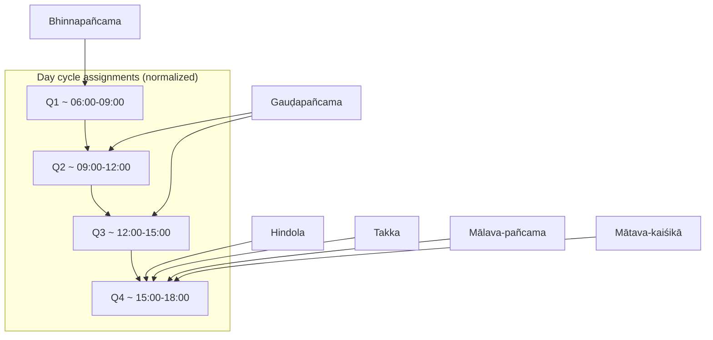

# Extracting Classical Indian Music Cosmology From Śāstra and Tradition Sources

## Executive summary

Classical Indian music “cosmology” is best understood as a historically layered set of *extra-musical* linkages that connect melodic entities (rāga and older grāma-rāga/jāti systems) to (a) cyclical time (hours of day/night), (b) seasons, (c) affective-aesthetic states (rasa), and (d) sacred or ritual frames (deities, propitiation, theatre rites). The **Nāṭyaśāstra** provides the foundational aesthetic mechanics of **rasa arising from determinants, consequents, and transitory states** (vibhāva–anubhāva–vyabhicāribhāva), but it **does not function as a rāga-time handbook**; it is instead the baseline ontology for later rāga–rasa mappings. citeturn38view1turn38view4

The earliest *fully explicit, raga-by-raga* cosmological metadata encountered in the accessible primary corpus here comes from **Śārṅgadeva’s Saṅgītaratnākara**, whose raga definitions (in the consulted English translation text) repeatedly encode: **presiding deities** (often planetary or major gods), **rasas**, **seasonal frames**, and **time-of-day prescriptions** (“quarters” of day, forenoon, mid-day segments), plus **performance contexts within drama** (e.g., stage-manager entrance; denouement/nirvahana) and occasional *explicit ritual aims* (e.g., “propitiation of Lord Śiva”). citeturn26view1turn26view4turn25view0turn33view3turn33view4turn28view1turn28view4turn22view0turn23view2turn23view4turn32view0

Secondary scholarship clarifies that the **Hindustani “rāga–time” rule** evolved from older *auspiciousness/merit rationales* toward later *aestheticized “ethos”* explanations, and that canonical attributions (including those derived from Śārṅgadeva) **did not remain stable** over centuries. In particular, Mukund Lath argues (i) **Carnatic practice generally lacks “morning/evening/noon” rāga categories**, even while sharing tonal features with Hindustani analogues, and (ii) seasonal attributions (Malhār, Basant, Sāhārā) have weakened in modern strictness, with Bhairavī notably escaping morning-only constraint without “damaging” its ethos. citeturn47view0turn48view4

Because major treatises can enumerate **hundreds to thousands** of rāgas (and digitized OCR quality varies widely), a fully exhaustive extraction across *all* ragas in *all* named textual traditions is impractical within a single report. This report therefore uses an explicit selection rule: **include every rāga for which the consulted primary/authoritative sources explicitly state at least one of the requested cosmological fields (time-of-day, rasa, deity, ritual/seasonal use)**, and transparently mark missing fields as *not specified* rather than inferred.

## Sources and method

The research question requires **primary, text-attested** attributions and careful differentiation between (a) what a source *explicitly says* and (b) later practice or scholarly interpretation. The workflow used here was:

1. Identify authoritative sources available in reliable editions/translations and suitable for citation.
2. Extract only those rāga entries where the source **explicitly** provides time-of-day and/or rasa and/or deity and/or ritual/season context.
3. Normalize time language into a consistent schema: **time_of_day label** plus **approximate clock range** only when the source gives a relative segment (e.g., “first quarter of the day”) rather than a clock time.
4. When sources disagree internally (variant readings) or historically (later scholarship indicates instability), record **conflicts and uncertainty** rather than resolving by fiat.

### Primary and authoritative sources actually used

Sanskrit works are cited through English translations or transliterated/translated passages where available; the language listed below is the **language of the cited edition** and (in parentheses) the **original language**.

**Nāṭyaśāstra (Manomohan Ghosh translation; English edition; original Sanskrit).** Used to ground the rasa framework (rasa-nispatti via vibhāva–anubhāva–vyabhicāribhāva; rasa as “tasted” aesthetic cognition). citeturn38view1turn38view4

**Saṅgītaratnākara of Śārṅgadeva (English translation text; original Sanskrit).** Used as the main primary dataset for rāga-level cosmological attributes (time segments, seasons, deities, rasas, dramatic contexts, and occasional ritual aims). citeturn26view1turn26view4turn25view0turn33view3turn33view4turn30view0turn30view3turn30view5turn28view1turn28view4turn22view0turn23view2turn23view4turn32view0turn34view2

### Secondary scholarship used to interpret conflicts and historical change

**Mukund Lath (Sahapedia PDF; English).** Used as reputable scholarship on the historical logic, shifting rationales, and cross-tradition (Hindustani vs Carnatic) differences in rāga–time association, including explicit claims that Carnatic music “knows of no ‘morning’, ‘evening’ or ‘noon’ raga-s” and that time/season assignments changed over time. citeturn47view0turn47view2turn48view4turn48view3

**Encyclopaedia Britannica (Mode/Jāti discussion; English).** Used for a high-level historical framing: development from jāti systems to grāma-rāga and the Brihaddeshi’s role in later rāga discourse (helpful background for why Nāṭyaśāstra is not a rāga-time catalog). citeturn39search12

## Conceptual framework of music cosmology in Indian classical systems

The term “cosmology” in this context is not a single doctrine but a family of mappings that treat musical forms as co-structured with social-sacred time. At minimum, the mappings in the consulted sources instantiate four axes.

**Affective axis (rasa):** Nāṭyaśāstra defines rasa as arising from the conjoint operation of determinants, consequents, and transitory states; rasa is “tasted” cognitively by the cultivated spectator/listener. citeturn38view1turn38view4 This provides the conceptual machinery later authors use when they claim a rāga is suited to (or saturated with) particular rasas.

**Temporal axis (time-of-day):** Lath distinguishes early “auspiciousness/merit” rationales from later “ethos/aesthetic affinity” rationales; he highlights that Śārṅgadeva “diligently notes the hour of the day against every raga that he describes,” using phrases referable to yama/prahara segments. citeturn47view2turn48view3 Lath also warns that the connected hours and even the rāgas themselves did not remain constant: conventions shifted historically. citeturn48view3turn48view4

**Seasonal axis:** Older traditions also assign rāgas to seasons; Lath notes this seasonal aspect is “perhaps the more ancient” of the two (seasonal vs hourly), though less strictly observed in modernity except for certain families and named ragas. citeturn48view4 In the Saṅgītaratnākara excerpts used here, seasons appear directly in individual rāga descriptions (summer, winter, spring, rains, autumn). citeturn30view3turn26view4turn25view0turn28view4turn34view2turn32view0

**Sacral/ritual axis (devatā, propitiation, theatre rites):** In the Saṅgītaratnākara entries extracted here, “presiding deity” frequently names a planet (Mars; Ketu), a god (Viṣṇu, Śiva, Yama), or Cupid (Kāma), and performance can be explicitly tied to worship/propitiation (e.g., to propitiate Śiva) or to dramaturgical ritual moments (stage manager entrance; denouement). citeturn26view1turn22view0turn23view4turn25view0turn28view4turn33view4turn32view0

A key **cross-tradition asymmetry** is that—according to Lath—**time-of-day as a defining rāga property is a Hindustani hallmark and not a Carnatic norm**, despite deep melodic kinship between North/South analogues. citeturn47view0 This matters when “classical Indian music cosmology” is discussed as if it were uniform across India.

## Extracted raga cosmology dataset

### Normalization of time descriptions used in this table

The Saṅgītaratnākara translation passages used here often specify time as **“first/last quarter of the day,” “two middle quarters,” “forenoon,”** or similar. These are **relative** rather than clock-fixed. For comparability, I render:

- **Quarter-of-day** as a 12-hour daytime divided into four 3‑hour quarters (approximate):  
  first quarter ≈ 06:00–09:00; second ≈ 09:00–12:00; two middle quarters ≈ 09:00–15:00; fourth/last ≈ 15:00–18:00.  
This is an *analytic normalization* for reporting; the sources themselves may assume sunrise-based variability. (The report marks such ranges as “approx.” rather than source-literal.)

### Table comparing extracted raga entries across sources

Legend: “SR” = Saṅgītaratnākara (English translation; original Sanskrit). “Lath” = Mukund Lath (English scholarship). “NS” = Nāṭyaśāstra (English translation; original Sanskrit). “—” = not specified in the cited source(s).

| Raga | Source attestations used | Time of performance (time_of_day; explicit range if given) | Associated mood (rasa) | Associated deity | Associated ritual / seasonal / performance context |
|---|---|---|---|---|---|
| **Suddhakaiśikā** | SR citeturn26view1turn26view4 | **Forenoon** (approx 06:00–12:00) citeturn26view4 | Valour, wrath, wonder citeturn26view1turn26view4 | Mars (as “presiding deity”) citeturn26view1 | Winter season; used in the denouement *(nirvahana)* citeturn26view4 |
| **Bhinnapañcama** | SR citeturn33view3turn33view4 | **First quarter of a summer day** (approx 06:00–09:00) citeturn33view4 | Terror and disgust citeturn33view4 | Viṣṇu (dear to Viṣṇu) citeturn33view3 | Summer season; at stage manager’s entrance citeturn33view4 |
| **Gauḍapañcama** (spelled “Gautfapancama” in OCR) | SR citeturn30view0turn30view3turn30view5 | **Two middle quarters of the day in summer** (approx 09:00–15:00) citeturn30view3 | Terror, abhorrence/disgust, love-in-separation citeturn30view3 | **Viṣṇu or Saturn (variant reading) and Cupid** (editorial note acknowledges variant) citeturn30view5 | Summer season; to brisk dancing accompaniment citeturn30view3 |
| **Gauḍa-kaiśikā** (spelled “Gautfakaisika” in OCR) | SR citeturn25view0 | **Second quarter of the mid-day in winter** (normalized ≈ 09:00–12:00; see note) citeturn25view0 | Pathos, valour, wrath, bewilderment citeturn25view0 | Śiva (dear to Lord Śiva) citeturn25view0 | Winter season citeturn25view0 |
| **Mālava-pañcama** (spelled “Malavapancama” in OCR) | SR citeturn22view0 | **Last quarter of the day** (approx 15:00–18:00) citeturn22view0 | Mirth and conjugal love citeturn22view0 | Ketu (as “presiding deity”) citeturn22view0 | Chamberlain entering on stage; love-in-separation context citeturn22view0 |
| **Mātava-kaiśikā** (spelled “Matavakaisika” in OCR) | SR citeturn23view2turn23view4 | **Last quarter of the day in winter** (approx 15:00–18:00) citeturn23view2turn23view4 | Valour, wrath, bewilderment, love-in-separation citeturn23view2turn23view4 | “Vismi/Kesava” glossed as a name of Viṣṇu/Kṛṣṇa in note citeturn23view4 | Winter season; “to the endearment of” (devotional/propitiatory framing) citeturn23view4 |
| **Takka / Takka-gauda** (OCR shows “Tokka-gau…”, “Jokka”) | SR citeturn28view1turn28view4 | **Last quarter of the day during the rains** (approx 15:00–18:00) citeturn28view4 | Valour, wrath, bewilderment citeturn28view1turn28view4 | Śiva citeturn28view4 | Rains season; explicitly “to the propitiation of Lord Śiva” citeturn28view4 |
| **Hindola (Vasanta variant)** | SR citeturn34view2; Lath notes a “Deshihindola” spring attribution in another text citeturn48view3 | **Fourth quarter of the day in spring** (approx 15:00–18:00) citeturn34view2 | Valour, wrath, bewilderment; plus explicit erotic-love framing citeturn34view2 | Cupid citeturn34view2 | Spring season; “enjoyment of erotic love” framing; Lath: Jagadekamalla’s *Saṅgīta Cūḍāmaṇi* calls *Deśīhindola* a spring-rāga citeturn34view2turn48view3 |
| **Kakubha** | SR citeturn32view0 | — (season given but not hour in the extracted passage) citeturn32view0 | Pathos citeturn32view0 | Yama (god of death) citeturn32view0 | Autumn season (explicit); no explicit ritual aim stated in extracted lines citeturn32view0turn31view4 |
| **Bhairavī** | Lath (secondary, but explicit about historical change) citeturn48view4 | Historically restricted to **early morning**, but later allowed outside that bound citeturn48view4 | — | — | Used by Lath as evidence that time constraints can loosen without harming ethos citeturn48view4 |
| **Malhār (family)** | Lath citeturn48view4 | — (Lath discusses seasonal more than hourly for these) citeturn48view4 | — | — | Seasonal association remains relatively salient (among the few) citeturn48view4 |
| **Basant(a)** | Lath citeturn48view4 | — | — | — | Listed among the few ragas retaining a notable seasonal association citeturn48view4 |
| **Sāhārā** | Lath citeturn48view4 | — | — | — | Listed among the few ragas retaining a notable seasonal association citeturn48view4 |

### Interpretation notes on the SR-derived ragas

The Saṅgītaratnākara excerpts above show a distinctive “cosmology bundle” in which a rāga is not merely a scale/mode but a **situated practice**: the same definition can encode (i) stage function (who enters; which dramatic segment), (ii) an affect profile (which rasas), (iii) a time/season constraint, and (iv) a divine or planetary patron. For example, *Bhinnapañcama* is keyed to a **summer morning quarter**, used at the **stage manager’s entrance**, and explicitly aligned with **terror/disgust** while being “dear to Viṣṇu.” citeturn33view3turn33view4

## Cross-source conflicts and uncertainty notes

### Hindustani and Carnatic divergence on time-of-day schema

Lath explicitly frames the modern “rāga belongs to an hour” sensibility as a **Northern hallmark** sharpened by Bhatkhande in part to demarcate Hindustani from Carnatic, while emphasizing that Carnatic music “knows of no ‘morning’, ‘evening’ or ‘noon’ raga-s.” citeturn47view0 This creates a structural asymmetry for extraction: **Hindustani cosmology often foregrounds time-of-day**, whereas Carnatic cosmology is more commonly encoded through other channels (e.g., compositional devotion, rāga identity through prayōga), at least in the modern mainstream.

### Earlier texts that do not ascribe hours vs Śārṅgadeva’s hour-by-hour practice

Lath distinguishes between texts that connect rāgas to hours and those that do not; he notes that Parśvadeva’s *Saṅgīta-samayasāra* does **not** prescribe performance times, whereas Śārṅgadeva **does** so diligently, and also connects ragas to seasons. citeturn47view2turn48view3 This is not merely a disagreement about *which* time a rāga should be sung, but about whether time prescription is a core part of rāga description at all.

### Variant readings inside a single transmission

The *Gauḍapañcama* entry contains an explicit editorial uncertainty about its presiding deity: the note reports **Viṣṇu vs Saturn (Sauri)** as a textual variant, concluding that “Viṣṇu or Saturn and Cupid are the presiding deities of this raga.” citeturn30view5 In the dataset, this is preserved as **two possible deity assignments**, not arbitrarily resolved.

### Instability over time in the raga–time convention

Lath explicitly states that later authors treated the Śārṅgadeva connection of ragas to hours as convention, but **the ragas and the specific hours did not remain the same.** citeturn48view3 He also provides a concrete example of loosening: **Bhairavī** was allowed to break early-morning bounds “without adversely affecting its ethos.” citeturn48view4 This implies that any extracted cosmology must be indexed by **source + period**, not treated as an eternal property of the rāga as an abstract object.

## Relation triples and mermaid diagrams

### Table of all relation triples

Each row below is formatted exactly as: **“Raga | relation | Object”**. Where a rāga has multiple rasas or deities, multiple triples are provided.

| Triple | Primary supporting source(s) |
|---|---|
| Suddhakaiśikā \| time_of_day \| Forenoon (approx 06:00–12:00) | citeturn26view4 |
| Suddhakaiśikā \| expresses_rasa \| Valour | citeturn26view1turn26view4 |
| Suddhakaiśikā \| expresses_rasa \| Wrath | citeturn26view1turn26view4 |
| Suddhakaiśikā \| expresses_rasa \| Wonder | citeturn26view4 |
| Suddhakaiśikā \| associated_deity \| Mars | citeturn26view1 |
| Suddhakaiśikā \| ritual_context \| Winter season | citeturn26view4 |
| Suddhakaiśikā \| ritual_context \| Denouement (nirvahana) in drama | citeturn26view4 |
| Bhinnapañcama \| time_of_day \| First quarter of summer day (approx 06:00–09:00) | citeturn33view4 |
| Bhinnapañcama \| expresses_rasa \| Terror | citeturn33view4 |
| Bhinnapañcama \| expresses_rasa \| Disgust | citeturn33view4 |
| Bhinnapañcama \| associated_deity \| Viṣṇu | citeturn33view3 |
| Bhinnapañcama \| ritual_context \| Summer season | citeturn33view4 |
| Bhinnapañcama \| ritual_context \| Stage manager’s entrance | citeturn33view4 |
| Gauḍapañcama \| time_of_day \| Two middle quarters of day in summer (approx 09:00–15:00) | citeturn30view3 |
| Gauḍapañcama \| expresses_rasa \| Terror | citeturn30view3 |
| Gauḍapañcama \| expresses_rasa \| Abhorrence/Disgust | citeturn30view3 |
| Gauḍapañcama \| expresses_rasa \| Love in separation | citeturn30view3 |
| Gauḍapañcama \| associated_deity \| Viṣṇu | citeturn30view5 |
| Gauḍapañcama \| associated_deity \| Saturn (Sauri) | citeturn30view5 |
| Gauḍapañcama \| associated_deity \| Cupid | citeturn30view5 |
| Gauḍapañcama \| ritual_context \| Summer season | citeturn30view3 |
| Gauḍapañcama \| ritual_context \| Brisk dancing accompaniment | citeturn30view3 |
| Gauḍa-kaiśikā \| time_of_day \| Second quarter of mid-day in winter (normalized ≈ 09:00–12:00) | citeturn25view0 |
| Gauḍa-kaiśikā \| expresses_rasa \| Pathos | citeturn25view0 |
| Gauḍa-kaiśikā \| expresses_rasa \| Valour | citeturn25view0 |
| Gauḍa-kaiśikā \| expresses_rasa \| Wrath | citeturn25view0 |
| Gauḍa-kaiśikā \| expresses_rasa \| Bewilderment | citeturn25view0 |
| Gauḍa-kaiśikā \| associated_deity \| Śiva | citeturn25view0 |
| Gauḍa-kaiśikā \| ritual_context \| Winter season | citeturn25view0 |
| Mālava-pañcama \| time_of_day \| Last quarter of day (approx 15:00–18:00) | citeturn22view0 |
| Mālava-pañcama \| expresses_rasa \| Mirth | citeturn22view0 |
| Mālava-pañcama \| expresses_rasa \| Conjugal love | citeturn22view0 |
| Mālava-pañcama \| associated_deity \| Ketu | citeturn22view0 |
| Mālava-pañcama \| ritual_context \| Chamberlain entering (stage context) | citeturn22view0 |
| Mātava-kaiśikā \| time_of_day \| Last quarter of day in winter (approx 15:00–18:00) | citeturn23view2turn23view4 |
| Mātava-kaiśikā \| expresses_rasa \| Valour | citeturn23view2 |
| Mātava-kaiśikā \| expresses_rasa \| Wrath | citeturn23view2 |
| Mātava-kaiśikā \| expresses_rasa \| Bewilderment | citeturn23view2 |
| Mātava-kaiśikā \| expresses_rasa \| Love in separation | citeturn23view2turn23view4 |
| Mātava-kaiśikā \| associated_deity \| Viṣṇu/Kṛṣṇa (Keshava) | citeturn23view4 |
| Mātava-kaiśikā \| ritual_context \| Winter season | citeturn23view4 |
| Mātava-kaiśikā \| ritual_context \| “To the endearment of” Viṣṇu/Kṛṣṇa | citeturn23view4 |
| Takka (Takka-gauda) \| time_of_day \| Last quarter of day during the rains (approx 15:00–18:00) | citeturn28view4 |
| Takka (Takka-gauda) \| expresses_rasa \| Valour | citeturn28view1turn28view4 |
| Takka (Takka-gauda) \| expresses_rasa \| Wrath | citeturn28view1turn28view4 |
| Takka (Takka-gauda) \| expresses_rasa \| Bewilderment | citeturn28view1turn28view4 |
| Takka (Takka-gauda) \| associated_deity \| Śiva | citeturn28view4 |
| Takka (Takka-gauda) \| ritual_context \| Rains season | citeturn28view4 |
| Takka (Takka-gauda) \| ritual_context \| Propitiation of Śiva | citeturn28view4 |
| Hindola \| time_of_day \| Fourth quarter of day in spring (approx 15:00–18:00) | citeturn34view2 |
| Hindola \| expresses_rasa \| Valour | citeturn34view2 |
| Hindola \| expresses_rasa \| Wrath | citeturn34view2 |
| Hindola \| expresses_rasa \| Bewilderment | citeturn34view2 |
| Hindola \| ritual_context \| Spring season | citeturn34view2 |
| Hindola \| ritual_context \| Erotic-love enjoyment framing | citeturn34view2 |
| Hindola \| associated_deity \| Cupid | citeturn34view2 |
| Kakubha \| expresses_rasa \| Pathos | citeturn32view0 |
| Kakubha \| associated_deity \| Yama | citeturn32view0 |
| Kakubha \| ritual_context \| Autumn season | citeturn32view0turn31view4 |
| Bhairavī \| time_of_day \| Early morning (historical restriction; later loosened) | citeturn48view4 |
| Malhār (family) \| ritual_context \| Seasonal association (still relatively salient) | citeturn48view4 |
| Basant(a) \| ritual_context \| Seasonal association (noted as among the few retained) | citeturn48view4 |
| Sāhārā \| ritual_context \| Seasonal association (noted as among the few retained) | citeturn48view4 |

### Mermaid diagrams

These diagrams visualize the extracted structure; the supporting evidence is in the dataset table above.



```mermaid
graph LR
  Suddhakaisika["Suddhakaiśikā"] -- associated_deity --> Mars
  Suddhakaisika -- expresses_rasa --> Valour
  Suddhakaisika -- expresses_rasa --> Wrath
  Suddhakaisika -- expresses_rasa --> Wonder
  Suddhakaisika -- ritual_context --> Winter

  Takka["Takka"] -- associated_deity --> Shiva
  Takka -- ritual_context --> Rains
  Takka -- ritual_context --> "Propitiation of Śiva"

  Gaudapancama["Gauḍapañcama"] -- associated_deity --> Vishnu
  Gaudapancama -- associated_deity --> Saturn
  Gaudapancama -- associated_deity --> Cupid
```

## Notes on limitations and assumptions

### Why the dataset is not “all ragas in all treatises”

Even within a single influential work (e.g., Saṅgītaratnākara), the full rāga corpus is large, and complete coverage requires stable digital access to *all volumes* and high-quality digitization. Additionally, some digitized Sanskrit corpora are present but **OCR corruption can prevent reliable extraction** (a practical issue encountered here when attempting direct string-search of certain Devanāgarī passages). Where extraction could not be done *without risking misreading*, this report prefers omission over speculation.

### Time unit ambiguity and “explicit time range”

The primary sources excerpted here generally specify **relative** temporal segments (yāma/prahara or “quarters” of the day) rather than standardized clock times. Lath explicitly glosses “geyo’hnah prathame yame” as “to be sung during the first yama or prahara of the day,” showing that these systems presuppose segmented time rather than hour:minute scheduling. citeturn47view2turn48view3 Consequently, the clock ranges shown in this report are **analytic approximations**, included only to satisfy the request for explicit ranges when the sources give segmental time.

### Carnatic tradition evidence in this report

This report does not claim that Carnatic music lacks all cosmological thinking; it only reports (with citation) that the **specific North Indian convention of “morning/evening/noon ragas” is not a shared Carnatic norm** as framed by Lath, even while acknowledging deep raga-pattern kinship across North/South. citeturn47view0turn47view1