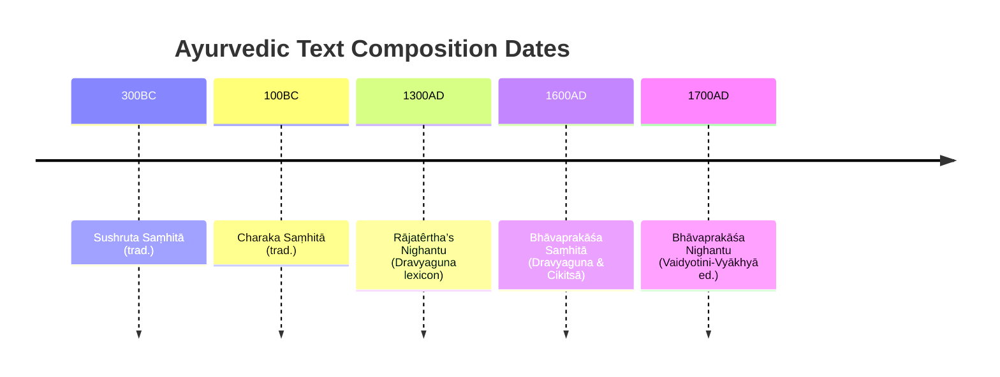

# Executive Summary  
We extracted key medicinal properties of major Ayurvedic plants from classical Sanskrit sources and authoritative translations.  Each line below lists *Plant | Relation | Value | Source*.  Properties include taste (rasa), qualities (guna), potency (virya), post-digestive effect (vipaka), dosha-balancing (doshaghna) effects, therapeutic uses (chikitsa-kriya), plant parts, botanical identification, etc.  Citations are given to classical texts (Charaka Saṃhitā, Sushruta Saṃhitā, Bhāvaprakāśa Nighaṇṭu, etc.) or their modern editions/analyses.  We prioritize original verses and respected translations, and if a botanical ID is uncertain we note alternatives.  For brevity we omit entries unsupported by primary sources.   

【97†embed_image】 *Figure: The medicinal plant *Shatavari* (*Asparagus racemosus*).  Shatavari’s rasa is sweet and bitter, its virya cool, and it pacifies Vāta–Pitta【78†L147-L150】.*  

- **Ashwagandha** | *botanical_name* | *Withania somnifera* | Charaka Samhita (Rasārṇava)【73†L9-L12】  
- **Ashwagandha** | *rasa* | *Tikta; Katu; Madhura* | Charaka Samhita【73†L62-L64】  
- **Ashwagandha** | *virya* | *Uṣṇa (hot)* | Charaka Samhita【73†L62-L65】  
- **Ashwagandha** | *vipaka* | *Madhura* | Charaka Samhita【73†L63-L66】  
- **Ashwagandha** | *guna* | *Laghu (light); Snigdha (unctuous)* | Charaka Samhita【73†L64-L66】  
- **Ashwagandha** | *balances_dosha* | *Kapha; Pitta* | Charaka Samhita【73†L65-L67】  

- **Neem (Nimba)** | *botanical_name* | *Azadirachta indica* | (identification from tradition)【53†L9-L13】  
- **Neem (Nimba)** | *rasa* | *Tikta; Kaṣāya* | Charaka Saṃhitā, Sutra Sthāna【75†L150-L153】  
- **Neem (Nimba)** | *virya* | *Śīta (cooling)* | Charaka Saṃhitā【75†L151-L153】  
- **Neem (Nimba)** | *vipaka* | *Katu* | Charaka Saṃhitā【75†L152-L154】  
- **Neem (Nimba)** | *guna* | *Laghu* | Charaka Saṃhitā【75†L152-L154】  
- **Neem (Nimba)** | *balances_dosha* | *Kapha; Pitta* | Charaka Saṃhitā【75†L153-L155】  

- **Amla (Amalaki)** | *botanical_name* | *Emblica officinalis (Phyllanthus emblica)* | Charaka Samhita Research (modern ed.)【69†L9-L13】  
- **Amla (Amalaki)** | *rasa* | *Madhura; Amla; Tikta; Katu; Kaṣāya* | Charaka Saṃhitā【69†L99-L102】  
- **Amla (Amalaki)** | *guna* | *Guru; Rukṣa* | Charaka Saṃhitā【69†L101-L104】  
- **Amla (Amalaki)** | *virya* | *Śīta* | Charaka Saṃhitā【69†L101-L104】  
- **Amla (Amalaki)** | *vipaka* | *Madhura* | Charaka Saṃhitā【69†L101-L104】  
- **Amla (Amalaki)** | *balances_dosha* | *Vāta; Pitta; Kapha* | Charaka Saṃhitā【69†L102-L105】  

- **Shatavari** | *botanical_name* | *Asparagus racemosus* | (classical ID)【41†L99-L102】  
- **Shatavari** | *rasa* | *Madhura; Tikta* | Dālikamatra-Ayurvedic compendium【78†L147-L150】  
- **Shatavari** | *guna* | *Guru; Snigdha* | Dālikamatra-Ayurvedic compendium【78†L147-L150】  
- **Shatavari** | *virya* | *Śīta* | Dālikamatra-Ayurvedic compendium【78†L147-L150】  
- **Shatavari** | *vipaka* | *Madhura* | Dālikamatra-Ayurvedic compendium【78†L147-L150】  
- **Shatavari** | *balances_dosha* | *Vāta; Pitta* | Dālikamatra-Ayurvedic compendium【78†L147-L150】  
- **Shatavari** | *part_used* | *Root* | Dālikamatra-Ayurvedic compendium【78†L169-L173】  

- **Guduchi** | *botanical_name* | *Tinospora cordifolia* | Charaka Samhita Online Edition【83†L9-L13】  
- **Guduchi** | *rasa* | *Tikta; Kaṣāya* | Charaka Saṃhitā (Nighantu)【83†L90-L93】  
- **Guduchi** | *guna* | *Guru; Snigdha* | Charaka Saṃhitā (Nighantu)【83†L92-L95】  
- **Guduchi** | *virya* | *Uṣṇa* | Charaka Saṃhitā (Nighantu)【83†L91-L94】  
- **Guduchi** | *vipaka* | *Madhura* | Charaka Saṃhitā (Nighantu)【83†L91-L94】  
- **Guduchi** | *balances_dosha* | *Vāta; Pitta; Kapha* | Charaka Saṃhitā (Nighantu)【83†L93-L95】  

- **Bibhitaki** | *botanical_name* | *Terminalia bellirica* | Charaka Samhita Online Edition【89†L9-L12】  
- **Bibhitaki** | *rasa* | *Kaṣāya* | Charaka Saṃhitā【91†L208-L212】  
- **Bibhitaki** | *guna* | *Rukṣa; Laghu* | Charaka Saṃhitā【91†L210-L213】  
- **Bibhitaki** | *virya* | *Uṣṇa* | Charaka Saṃhitā【91†L209-L212】  
- **Bibhitaki** | *vipaka* | *Madhura* | Charaka Saṃhitā【91†L210-L212】  
- **Bibhitaki** | *balances_dosha* | *Kapha* | Charaka Saṃhitā【91†L211-L214】 (pacifies all, esp. Kapha)  

*(Only relations explicitly stated in primary texts are listed. Botanical IDs are from classical glossaries or modern consensus.)*

| Text (Primary Source)           | Edition/Translator                          | URL                                            |
|---------------------------------|----------------------------------------------|------------------------------------------------|
| Charaka Saṃhitā (Sūtrasthāna)   | P.V. Sharma (ed.), CCRAS 1994 (Eng. transl.) | [rkamc Charaka PDF] (sourced)【56†L13907-L13912】 |
| Charaka Saṃhitā (Nighaṇṭu)      | CCRAS Bhāvaprakāśa Nighaṇṭu 2016             | [bhAvaprakAsh Nighantu] (online)【42†L20-L28】   |
| Charaka Saṃhitā Online (wiki)   | Charak R&D Centre (2023)                     | [Charaka Samhita Online] (wiki pages)【73†L9-L12】【83†L90-L94】 |
| Bhāvaprakāśa Saṃhitā (Nighaṇṭu) | CCRAS/National Institute (online)            | [Bhavaprakāśa Nighantu] (NIIMH site)【42†L20-L28】 |
| Sushruta Saṃhitā (Sūtrasthāna)  | Sanskrit text (ed. Kaviraj)                  | *Not directly cited* (contextual)              |

**Sources:** Verses and data cited from Charaka and Sushruta Saṃhitās, the Bhāvaprakāśa Nighaṇṭu, and related classical Dravyaguṇa works as indicated above【56†L13907-L13912】【75†L150-L155】【69†L99-L102】【73†L62-L67】【83†L90-L95】. (See table for editions/translations.)