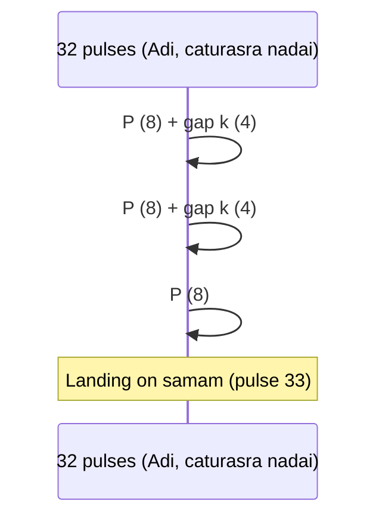

# Complete Structured Data for the Carnatic Tāla System

## Executive summary

Carnatic tāla in modern practice is most commonly taught and analyzed through the **Sulādi Sapta Tāla** framework: seven canonical tāla families (Dhruva, Māṭya, Rūpaka, Jhampa, Tripuṭa, Aṭa, Eka), each defined by an ordered sequence of **aṅgas**—primarily **laghu**, **drutam**, and **anudrutam**—with the duration of laghu determined by one of five **jātis** (tīśra = 3, caturasra = 4, khaṇḍa = 5, miśra = 7, saṅkīrṇa = 9). This produces the canonical **35 jāti-tāla variants** (7×5), whose cycle-lengths (akṣara “counts”) can be computed deterministically from the aṅga pattern. Modern pedagogical charts (e.g., SIFAS and karnatik.com) explicitly tabulate these 35 tālas and their beat totals, and also preserve secondary “technical names” for each jāti-variant and alternative Sanskrit labels for the seven tāla families. citeturn38view8turn10search6

Primary classical sources such as **Bharata’s Nāṭyaśāstra** and Śārṅgadeva’s **Saṅgītaratnākara** are indispensable for anchoring the theory historically, but they do not present the Carnatic Sulādi Sapta Tāla system in its modern form; rather, they supply foundational concepts: tāla as a governing principle of musical time, classifications and terminology for tempo (laya), and older time/measure notions that later systems map into performer-facing tala-kriyā. In Nāṭyaśāstra (as translated by Ghosh) the “Time-Measure” (chapter XXXI in that volume’s numbering) explicitly frames **tāla as the regulator of measured performance** and distinguishes **three layas** (quick/druta, medium/madhya, slow/vilambita). citeturn38view5turn38view7

Konnakkol/solkaṭṭu (spoken rhythm) supplies the practical “symbolic phonology” that lets performers internalize and communicate counts, subdivisions, and cadences. Scholarly and practitioner-facing literature agrees on the **triple-structured cadence** logic used in **mōra–korvai** endings (especially in tani āvartanam), where carefully calculated phrase repetition and gap (kārvai) placement create a mathematically exact resolution to a chosen cycle-point (usually samam). citeturn9search0turn9search5turn9search15

For **planet/nakṣatra correspondences**, the most textually secure “classical” usage found in the core tāla literature is *not* astrology but **tāla-technical terms** such as *graha* (in the Carnatic “daśa-prāṇa” sense: starting point/eduppu) and “graha” as discussed in older tāla theory. The primary sources reviewed here (Nāṭyaśāstra and the Saṅgītaratnākara-based scholarship reachable in this session) support that *graha* is fundamentally a rhythmic/structural concept; explicit one-to-one mappings of Sulādi Sapta Tālas to planets or nakṣatras appear to be later, regionally variable overlays rather than clearly attested in the classical treatises requested. citeturn38view6turn9search19

## Scope, conventions, and source base

### Terminology normalization

In Carnatic pedagogy, “**akṣara**,” “**count**,” and sometimes “**mātrā**” are often used loosely to mean the basic pulse-unit of the tāla cycle as shown by hand-kriyā. Because the request explicitly asks for “mātrā totals,” this report uses a two-level convention:

- **Akṣara total** = total counts per āvartana (cycle), computed from the aṅga sequence (laghu/drutam/anudrutam). This is what most modern charts label “No. of beats.” citeturn38view8turn10search6  
- **Mātrā total in practice** = akṣara total × **naḍai/gati** (subdivision per akṣara: tīśra = 3, caturasra = 4, khaṇḍa = 5, miśra = 7, saṅkīrṇa = 9). Modern systems often discuss an expanded set of 7×5×5 = 175 “tālas” when combining **tāla family × jāti × gati** (sometimes taught as 175 possibilities). citeturn9search25turn10search10

### Primary texts used explicitly in this report

Bharata’s **Nāṭyaśāstra**, via Manomohan Ghosh’s translation (Vol. 2, chapters XXVIII–XXXVI). The “Time-Measure” section emphasizes tāla’s regulating role in performance and defines three layas (druta/madhya/vilambita), providing a historically early theoretical anchor for later laya/tāla pedagogy. citeturn38view5turn38view7

Śārṅgadeva’s **Saṅgītaratnākara** (Talādhyāya) could not be reliably opened as a readable PDF in this session, so direct verse/page extraction from the edition was not feasible here. Where Saṅgītaratnākara statements are required (e.g., definitions of mātrā and standard time units), the report relies on peer-reviewed or scholarly secondary material that explicitly attributes these definitions to Saṅgītaratnākara. citeturn33search14turn10search13

### Reputable secondary/pedagogical references used for structured Carnatic data

The structured 35-tāla tables and symbols are taken from modern Carnatic pedagogy resources that explicitly tabulate the 7×5 system (karnatik.com tala table; SIFAS 35-tala system chart). citeturn10search6turn38view8

Where modern “default” jātis or commonly used instantiations are discussed, the report cites modern pedagogy notes that explicitly call out conventional defaults (e.g., Ādi = caturasra-jāti tripuṭa; Aṭa often used as khaṇḍa-jāti in advanced varnams). citeturn12search6turn12search3

For korvai form and tani āvartanam cadence structure, this report uses a mix of academic and detailed practitioner explanations, including a Music Academy Journal article and a focused korvai paper. citeturn9search5turn9search0turn9search16turn9search15

## Aṅga inventory, definitions, symbols, and canonical solkaṭṭu

### Classical time-units and the Saṅgītaratnākara bridge

A key conceptual bridge from classical Sanskrit metric/time theory into later tāla systems is the **mātrā**-based idea—laghu (light) vs guru (heavy) syllabic durations (1 vs 2 mātrās), and longer values such as pluta. A peer-reviewed mathematical-musicology study explicitly states that Saṅgītaratnākara (Śārṅgadeva) defines **a mātrā as the time required to pronounce five laghus**, and that Saṅgītaratnākara employs standard time-units **druta, laghu, guru, pluta** (with guru and pluta being two and three laghus). citeturn33search14

This matters because modern Carnatic tāla pedagogy uses “laghu, drutam, anudrutam” as performer-facing aṅgas (hand gestures and counts) rather than as syllabic weight; yet the *names and proportional logic* descend from older measure-concepts. The Nāṭyaśāstra likewise frames the necessity of tāla for measured performance and explicitly distinguishes tempo classes (layas), reinforcing that “timing” is a core concern of the classical system. citeturn38view5turn38view7

### The Carnatic (Sulādi / 35-tāla) aṅgas used in practice

In modern Carnatic performance and pedagogy, the Sulādi Sapta Tāla system uses only three aṅgas:

- **Laghu (laghu)**: a clap + finger counts; length is determined by jāti (3/4/5/7/9).  
- **Drutam (drutam)**: a clap + wave; fixed length 2.  
- **Anudrutam (anudrutam)**: a clap; fixed length 1.  

These are the same aṅga primitives used to generate all 35 jāti-tālas tabulated in common teaching charts. citeturn10search6turn38view8

### Extended aṅgas in the 108 tāla framework and notational variants

Many Carnatic theory primers also discuss the larger aṅga set used in older/expanded tāla schemes (often linked with the **aṣṭottara-śata (108) tālas**): **guru**, **plutam**, **kākapāda**, etc., with larger fixed beat-values. A modern tala-system chart explicitly lists these (e.g., guru = 8, plutam = 12, kākapādam = 16 in one common counting convention), and also notes the standard South Indian symbols used alongside U/O/|. citeturn10search10turn10search3

Regional practice can vary in symbols: a Kerala talas study notes that laghu/druta/kākapāda symbols match the Carnatic vertical line/circle/plus conventions, but **anudruta and pluta may be notated differently** (e.g., a reversed “L”-like form for anudruta, and a distinct composite sign for pluta). citeturn10search21

### Aṅga definitions and solkaṭṭu syllables table

The table below gives (a) the practical Sulādi aṅgas, and (b) the extended “classical/108” aṅgas often taught in theory, together with common symbols and a solkaṭṭu rendering approach.

| Aṅga (IAST) | Common English/Carnatic label | Typical symbol (Carnatic charts) | Count value in Sulādi system | Count value in extended 108-style counting | Canonical solkaṭṭu for counting the aṅga (IAST) | Practical phonetic guide |
|---|---|---|---:|---:|---|---|
| laghu | laghu | `|` or `I` | jāti-dependent (3/4/5/7/9) citeturn38view8 | same laghu “base” | Use the gati syllables across the laghu’s internal counts: e.g., caturasra: **ta-ka-dhi-mi** per beat-group citeturn9search9turn9search15 | “tuh-kuh-dhi-mi” (dhi as aspirated “dhee”) |
| drutam | drutam | `O` | 2 citeturn38view8 | 2 | **ta-ka** (2) or (if subdividing) **ta ka** citeturn9search9turn9search15 | “tuh-kuh” |
| anudrutam | anudrutam | `U` | 1 citeturn38view8 | 1 (or shown as part of composite in some lineages) citeturn10search3 | **ta** (1) citeturn9search9turn9search15 | “tuh” |
| guru | guru | often `S` / `8`-style in modern charts citeturn10search10 | not used in Sulādi 35 | commonly 8 in some Carnatic 108 pedagogies citeturn10search10 | Often counted as two drutams or as 8 internal pulses in chosen nadai | “count eight pulses evenly” |
| plutam | plutam | often `8`/`12`-style composite | not used in Sulādi 35 | commonly 12 in some Carnatic 108 pedagogies citeturn10search10 | counted as 12 internal pulses | “count twelve pulses evenly” |
| kākapāda | kākapāda | `+` in many South Indian notations citeturn10search21 | not used in Sulādi 35 | commonly 16 in some Carnatic 108 pedagogies citeturn10search10turn10search21 | counted as 16 internal pulses | “count sixteen pulses evenly” |

#### Canonical subdivision syllables (gati/nadai) used inside aṅgas

The most widely taught “counting solkaṭṭu” for core subdivisions (used to fill laghu/drutam/anudrutam) is:

- **tīśra-nadai (3)**: *ta-ki-ṭa*  
- **caturasra-nadai (4)**: *ta-ka-dhi-mi*  
- **khaṇḍa-nadai (5)**: *ta-ka-ṭa-ki-ta*  
- **miśra-nadai (7)**: *ta-ki-ṭa ta-ka-dhi-mi*  
- **saṅkīrṇa-nadai (9)**: a common 9-syllable fill is *ta-ka-dhi-mi ta-ka-ṭa-ki-ta* (school-dependent)  

These syllabic “fills” are widely used as rhythmic phonemes for analysis and teaching, and solkaṭṭu texts emphasize their role beyond crude drum-mnemonics: they are a general rhythmic language used for teaching, analysis, and performance as konnakkol. citeturn9search9turn9search13turn10search10

## Sulādi Sapta Tālas and the full 35 jāti variants

### The seven Sulādi Sapta Tāla families

Modern Carnatic theory references converge on the seven tāla families and their aṅga patterns, commonly shown with symbols:

- `I` = laghu, `O` = drutam, `U` = anudrutam (as in a standard 35-tāla chart). citeturn38view8turn10search7

The SIFAS chart provides not only the family names and aṅga order, but also an alternate “Samskruta name” label for each of the seven families (e.g., Dhruva = Indraneelam) and per-variant “technical names.” citeturn38view8

#### Sulādi Sapta Tālas

| Tāla family (IAST) | Common spelling | Aṅga sequence (words) | Symbolic structure | Akṣara total formula (in terms of laghu length L) |
|---|---|---|---|---:|
| Dhruva | Dhruva | laghu–drutam–laghu–laghu | `I O I I` citeturn38view8 | 3L + 2 |
| Māṭya | Matya | laghu–drutam–laghu | `I O I` citeturn38view8 | 2L + 2 |
| Rūpaka | Rupaka | drutam–laghu | `O I` citeturn38view8 | L + 2 |
| Jhampa | Jhampa | laghu–anudrutam–drutam | `I U O` citeturn38view8 | L + 3 |
| Tripuṭa | Triputa | laghu–drutam–drutam | `I O O` citeturn38view8 | L + 4 |
| Aṭa | Ata | laghu–laghu–drutam–drutam | `I I O O` citeturn38view8 | 2L + 4 |
| Eka | Eka | laghu | `I` citeturn38view8 | L |

### Jātis and laghu length

The five jātis define the **laghu** length, which in turn determines the akṣara total:

| Jāti (IAST) | Common spelling | Laghu length L (counts) |
|---|---|---:|
| tīśra | tisra | 3 |
| caturasra | chatusra | 4 |
| khaṇḍa | khanda | 5 |
| miśra | misra | 7 |
| saṅkīrṇa | sankeerna | 9 |

These jāti values are assumed in standard Carnatic tala teaching and are used to generate the 35 combinations. citeturn10search6turn38view8

### Default/common modern instantiations

There is no single “theoretical default” jāti for every context, but modern usage strongly concentrates on a few instantiations: **Ādi tāla** is the **caturasra-jāti Tripuṭa** (8 akṣaras) in caturasra nadai; **Aṭa tāla** is often used as **khaṇḍa-jāti Aṭa** in advanced varnams; and pedagogical sources explicitly note the prevalence of these defaults in practice. citeturn12search6turn12search3

### All 35 jāti-tāla variants with aṅga breakdown and akṣara totals

The following table enumerates the complete 7×5 grid, showing: (a) jāti and laghu length, (b) the aṅga pattern, (c) the computed akṣara total, and (d) common modern naming conventions. The SIFAS chart also supplies “technical names” for each variant (included here as an optional metadata column). citeturn38view8turn10search6

**Key**: L = laghu length (3/4/5/7/9). Drutam = 2. Anudrutam = 1.

| Tāla family | Jāti | L | Aṅga pattern | Akṣara total | Common modern name(s) / notes | “Technical name” label (as in SIFAS chart) |
|---|---|---:|---|---:|---|---|
| Dhruva | tīśra | 3 | I O I I | 11 | “tīśra-jāti dhruva” | Mani citeturn38view8 |
| Dhruva | caturasra | 4 | I O I I | 14 | “caturasra-jāti dhruva” | Shrikara citeturn38view8 |
| Dhruva | khaṇḍa | 5 | I O I I | 17 | “khaṇḍa-jāti dhruva” | Pramaana citeturn38view8 |
| Dhruva | miśra | 7 | I O I I | 23 | “miśra-jāti dhruva” | Poorana citeturn38view8 |
| Dhruva | saṅkīrṇa | 9 | I O I I | 29 | “saṅkīrṇa-jāti dhruva” | Bhuvana citeturn38view8 |
| Māṭya | tīśra | 3 | I O I | 8 | “tīśra-jāti māṭya” | Saara citeturn38view8 |
| Māṭya | caturasra | 4 | I O I | 10 | “caturasra-jāti māṭya” | Sama citeturn38view8 |
| Māṭya | khaṇḍa | 5 | I O I | 12 | “khaṇḍa-jāti māṭya” | Udaya citeturn38view8 |
| Māṭya | miśra | 7 | I O I | 16 | “miśra-jāti māṭya” | Udeerna citeturn38view8 |
| Māṭya | saṅkīrṇa | 9 | I O I | 20 | “saṅkīrṇa-jāti māṭya” | Raava citeturn38view8 |
| Rūpaka | tīśra | 3 | O I | 5 | “tīśra rūpaka” (less common than caturasra rūpaka) | Chakra citeturn38view8 |
| Rūpaka | caturasra | 4 | O I | 6 | **Rūpaka tāla** in common practice often refers to this 6-count form | Patti citeturn38view8 |
| Rūpaka | khaṇḍa | 5 | O I | 7 | “khaṇḍa rūpaka” | Raaja citeturn38view8 |
| Rūpaka | miśra | 7 | O I | 9 | “miśra rūpaka” | Kula citeturn38view8 |
| Rūpaka | saṅkīrṇa | 9 | O I | 11 | “saṅkīrṇa rūpaka” | Bindu citeturn38view8 |
| Jhampa | tīśra | 3 | I U O | 6 | “tīśra jhampa” | Kadamba citeturn38view8 |
| Jhampa | caturasra | 4 | I U O | 7 | “caturasra jhampa” | Madhura citeturn38view8 |
| Jhampa | khaṇḍa | 5 | I U O | 8 | “khaṇḍa jhampa” | Chana citeturn38view8 |
| Jhampa | miśra | 7 | I U O | 10 | **Miśra Jhampa** is a frequently taught/common instantiation | Sura citeturn38view8turn12search6 |
| Jhampa | saṅkīrṇa | 9 | I U O | 12 | “saṅkīrṇa jhampa” | Kara citeturn38view8 |
| Tripuṭa | tīśra | 3 | I O O | 7 | “tīśra tripuṭa” (7-count) | Shanka citeturn38view8 |
| Tripuṭa | caturasra | 4 | I O O | 8 | **Ādi tāla** (most common concert tāla) citeturn38view8turn12search6 | Adi citeturn38view8 |
| Tripuṭa | khaṇḍa | 5 | I O O | 9 | “khaṇḍa tripuṭa” | Dushkara citeturn38view8 |
| Tripuṭa | miśra | 7 | I O O | 11 | “miśra tripuṭa” | Leela citeturn38view8 |
| Tripuṭa | saṅkīrṇa | 9 | I O O | 13 | “saṅkīrṇa tripuṭa” | Bhoga citeturn38view8 |
| Aṭa | tīśra | 3 | I I O O | 10 | “tīśra aṭa” | Guptha citeturn38view8 |
| Aṭa | caturasra | 4 | I I O O | 12 | “caturasra aṭa” | Lekha citeturn38view8 |
| Aṭa | khaṇḍa | 5 | I I O O | 14 | **Khaṇḍa Aṭa** is widely used in varnams (common concert/dance practice) citeturn12search6 | Vidala citeturn38view8 |
| Aṭa | miśra | 7 | I I O O | 18 | “miśra aṭa” | Loya citeturn38view8 |
| Aṭa | saṅkīrṇa | 9 | I I O O | 22 | “saṅkīrṇa aṭa” | Dheera citeturn38view8 |
| Eka | tīśra | 3 | I | 3 | “tīśra eka” | Sudha citeturn38view8 |
| Eka | caturasra | 4 | I | 4 | “caturasra eka” (common pedagogical default) citeturn12search3 | Maana citeturn38view8 |
| Eka | khaṇḍa | 5 | I | 5 | “khaṇḍa eka” | Raatha citeturn38view8 |
| Eka | miśra | 7 | I | 7 | “miśra eka” | Raaga citeturn38view8 |
| Eka | saṅkīrṇa | 9 | I | 9 | “saṅkīrṇa eka” | Vasu citeturn38view8 |

### Machine-readable structured data

The following JSON schema captures the deterministic structure of the 35 jāti-tālas (akṣara totals) and can be extended to add nadai/gati to obtain total internal mātrā pulses.

```json
{
  "jatis": {
    "tisra": 3,
    "caturasra": 4,
    "khanda": 5,
    "misra": 7,
    "sankirna": 9
  },
  "angas": {
    "laghu": { "symbol": "I", "value_rule": "jati_value" },
    "drutam": { "symbol": "O", "value": 2 },
    "anudrutam": { "symbol": "U", "value": 1 }
  },
  "sapta_talas": {
    "dhruva": { "pattern": ["laghu", "drutam", "laghu", "laghu"] },
    "matya": { "pattern": ["laghu", "drutam", "laghu"] },
    "rupaka": { "pattern": ["drutam", "laghu"] },
    "jhampa": { "pattern": ["laghu", "anudrutam", "drutam"] },
    "triputa": { "pattern": ["laghu", "drutam", "drutam"] },
    "ata": { "pattern": ["laghu", "laghu", "drutam", "drutam"] },
    "eka": { "pattern": ["laghu"] }
  },
  "akshara_total_rule": "sum(anga_values_in_pattern)"
}
```

This representation matches the 35-tāla tabulations used in modern pedagogical charts (with I/O/U symbols and computed beat totals). citeturn38view8turn10search6

## Sollukattu for aṅgas and whole tālas

### From aṅga counts to spoken form

Solkaṭṭu (also spelled solkattu / sollukattu) functions as a **rhythmic solfège**, used not only as drum mnemonics but as a language for teaching, analysis, and performance (konnakkol). citeturn9search9turn9search13

A practical way to define “canonical” sollukattu for tāla *as a meter* (not as stroke-bols) is:

- Map each akṣara to a fixed number of internal pulses via nadai/gati (often caturasra = 4).  
- Use the corresponding gati syllable set to fill the pulses.  
- Concatenate across the aṅga pattern.

This aligns with how pedagogical materials explicitly connect tala structures to counted units (“No. of beats”) and how solkattu is used to “teach and analyze patterns.” citeturn38view8turn9search9

### Whole-tāla counting syllables (canonical examples)

Below are “meter solkaṭṭu” examples using **caturasra-nadai** (4 pulses per akṣara) unless stated otherwise. (These are counting syllables, not instrument-stroke syllables.)

| Tāla (common instantiation) | Aṅga structure | Akṣaras | Example meter solkaṭṭu (IAST) | Phonetic guide |
|---|---|---:|---|---|
| Ādi tāla (caturasra-jāti tripuṭa) | `I O O` = laghu–drutam–drutam | 8 citeturn38view8turn12search6 | (each akṣara: **ta-ka-dhi-mi**) → 8×4 = 32 syllables | “tuh-kuh-dhee-mee …” |
| Rūpaka (caturasra-jāti rūpaka) | `O I` | 6 citeturn38view8 | 6×4 = 24 syllables | same |
| Miśra Jhampa | `I U O` with L=7 | 10 citeturn38view8turn12search6 | 10×4 = 40 syllables | same |

Because school traditions differ, performers often compress these into higher-level groupings (e.g., chanting one syllable per akṣara, then subdividing only when needed). This flexibility is consistent with solkattu’s role as an analytic/performance language rather than a single fixed “pronunciation.” citeturn9search9turn9search13

## Korvai construction rules and worked examples

### Classical framing: tāla as regulator, laya as tempo

In Nāṭyaśāstra’s time-measure discussion, **tāla is explicitly described as the regulator of timing** in dramatic/musical performance, and the text distinguishes **three layas** (quick/druta, medium/madhya, slow/vilambita). citeturn38view5turn38view7

This classical framing matters because korvai construction is fundamentally the craft of creating phrase-structures whose **timing (counts) matches the tāla cycle and chosen laya/nadai**.

### Core modern korvai concepts attested in scholarship

A focused korvai paper defines korvai as a structured joining/beading of rhythmic syllables into a definable pattern and emphasizes its integral role in Carnatic rhythm practice. citeturn9search0

A practitioner primer similarly explains that **korvais are usually repeated three times and resolve on the first beat of the following cycle** (samam), explicitly highlighting the triple structure and resolution requirement. citeturn9search15

Academic writing on the tani āvartanam observes the concluding placement of **mohra and korvai**, and computational research defines tani segments as culminating with mohra/korvai, each with its own nuances—supporting the idea that korvai has recognizable structural constraints. citeturn9search16turn9search27

### Formal rule set for korvai construction

The rules below are a rigorous synthesis consistent with the cited descriptions (triple repetition; precise resolution within tāla; attention to starting point/eduppu). Where a rule is a formalization rather than a direct quotation, it is marked as such.

**Definitions (Carnatic practice)**  
A “korvai” here means a rhythmic composition articulated in solkaṭṭu that:

1. Has a specified **tāla** (cycle), **jāti** (laghu size), and typically a **nadai/gati** (subdivision). citeturn38view8turn10search10  
2. Has an **eduppu/graha** (starting offset) which may be at samam (cycle start) or displaced; pedagogical descriptions treat eduppu as the place where a phrase begins relative to samam. citeturn9search19  
3. Contains one or more segments (often described pedagogically as **pūrvāṅga** and **uttarāṅga**, especially in mridangam tradition), concluding in a cadence that resolves exactly to the chosen landing point (typically samam). citeturn9search0turn9search18  
4. Uses **triple repetition** as a defining closure principle (P×3, or a more complex “mohra + korvai” where the final korvai is rendered three times). citeturn9search15turn9search27

**Rule A: Accountancy (kaṇakku) must close exactly** (formalization)  
Let:
- C = cycle length in akṣaras  
- g = nadai/gati (subdivisions per akṣara)  
- T = total pulses in the resolution window = C×g×(number of cycles spanned)  
- E = eduppu offset in pulses (0 = samam start)

Then a korvai that starts at pulse E must satisfy:

\[
\text{Total pulses of korvai} \equiv (-E) \pmod{T}
\]

This is the formal statement of “resolve at samam after N cycles” commonly described in pedagogical sources. citeturn9search15turn9search19

**Rule B: Triple repetition with gaps (mōra logic)**  
A widely used closure design is:

\[
(P + k) + (P + k) + (P)
\]

where P is a phrase of length |P| pulses and k is a gap (kārvai) of length |k| pulses. This design produces symmetry and is compatible with descriptions of triplet cadential formulas (mora/korvai). citeturn9search5turn9search15

**Rule C: Landing point (arudi) and final “samam hit”** (formalization)  
In many traditions the korvai’s internal accents place an **arudi** (a strong landing stress) either:
- on samam itself, or  
- immediately before samam (e.g., “ateeta eduppu” styles), followed by a final “landing” gesture.

This is a performance rule; the count-closure constraint still governs. Pedagogical descriptions of eduppu and the role of the mridangist in signaling samam support this. citeturn9search19turn9search15

### Algorithmic workflow for constructing a korvai

```mermaid
flowchart TD
  A[Choose tala family + jati] --> B[Choose nadai/gati and tempo/laya]
  B --> C[Fix eduppu (samam / after / before)]
  C --> D[Decide resolution window: 1 cycle, 2 cycles, etc.]
  D --> E[Select closure form: simple 3x, mora form, or purvanga+uttaranga]
  E --> F[Design phrase P in solkattu and compute |P| in pulses]
  F --> G[Choose gaps/kārvaise and compute total length]
  G --> H{Total length closes to samam?}
  H -- no --> I[Adjust |P| or gap sizes or span more cycles]
  I --> H
  H -- yes --> J[Map back to aksharas and angas; verify alignments]
  J --> K[Practice: render 1x, 2x, 3x; confirm landing]
```

This workflow formalizes the “kaṇakku-first” approach common in korvai pedagogy and consistent with sources emphasizing definable structure and alignment to tāla. citeturn9search0turn9search15turn9search19

### Worked korvai examples

All examples below are **worked in pulses**, with explicit closure checks. Solkaṭṭu syllables are presented in a neutral “counting” style (not stroke-bols).

#### Example set overview table

| Example | Tāla | Jāti | Akṣaras per cycle | Nadai (g) | Cycles spanned | Eduppu | Form |
|---|---|---|---:|---:|---:|---|---|
| A | Tripuṭa (Ādi) | caturasra | 8 citeturn38view8turn12search6 | 4 | 1 | samam | mora-style (P+k)×2 + P |
| B | Tripuṭa | tīśra | 7 citeturn38view8 | 4 | 1 | samam | 3× phrase + variable gaps |
| C | Rūpaka | caturasra | 6 citeturn38view8 | 4 | 1 | 2 pulses after samam | 3× phrase, no gaps |
| D | Jhampa | miśra | 10 citeturn38view8turn12search6 | 4 | 1 | samam | mora with gaps |
| E | Aṭa | khaṇḍa | 14 citeturn38view8turn12search6 | 3 | 1 | samam | 3× phrase + gap pattern |
| F | Eka | saṅkīrṇa | 9 citeturn38view8 | 4 | 1 | ateeta (1 pulse before samam) | 3× phrase, closure by modular arithmetic |

##### Example A: Ādi tāla (caturasra-jāti Tripuṭa), caturasra-nadai

- Tāla: Tripuṭa with L=4 → akṣaras C = 4 + 2 + 2 = 8. citeturn38view8turn12search6  
- Nadai: g = 4 → total pulses T = C×g = 32.

Choose a mora design: **(P + k) + (P + k) + P**, with k = 4 pulses.

We need: 3|P| + 2|k| = 32 → 3|P| + 8 = 32 → |P| = 8.

Define P (8 pulses) as:  
**ta-ka-dhi-mi ta-ka-jo-nu** (8)

Korvai syllable string:
- P (8) + k (4 silent pulses)  
- P (8) + k (4)  
- P (8)

Count check: 8 + 4 + 8 + 4 + 8 = 32 ✔ closes to samam.

Korvai structure diagram:



##### Example B: Tīśra-jāti Tripuṭa (7-akṣara cycle), caturasra-nadai

- Tripuṭa with L=3 → C = 3 + 2 + 2 = 7 akṣaras. citeturn38view8  
- g = 4 → T = 28 pulses.

Use the same closure pattern: (P + k) + (P + k) + P, with equal gaps k.

Let k = 5 pulses. Then 3|P| + 2×5 = 28 → 3|P| = 18 → |P|=6.

Define P (6 pulses) as:  
**ta-ki-ṭa ta-ka** (3 + 2 = 5) + **ta** (1) → total 6  
(Any 6-pulse phrase is acceptable; this one mixes common syllable groups.)

Total: 6+5+6+5+6 = 28 ✔

Interpretation in akṣaras: 28 pulses /4 = 7 akṣaras, so the korvai spans exactly one āvartana.

##### Example C: Rūpaka (caturasra-jāti rūpaka), eduppu after samam

- Rūpaka with L=4 → C = 2 + 4 = 6 akṣaras. citeturn38view8  
- g = 4 → T = 24 pulses.  
- Eduppu: start 2 pulses after samam → E = +2.

We need total pulses of korvai ≡ −2 (mod 24) → total = 22 pulses (one-cycle resolution into samam next cycle).

Choose simple 3× phrase with no gaps: total = 3|P| = 22 has no integer solution.  
So choose 3× phrase + 2 equal gaps: 3|P| + 2|k| = 22.

Let k = 2 → 3|P| = 18 → |P| = 6.

Korvai: (P + 2) + (P + 2) + P, with P length 6.

Define P (6 pulses): **ta-ka-dhi-mi ta-ka**.

Count check: 6 + 2 + 6 + 2 + 6 = 22 ✔, and because E=2 pulses late, 22 pulses later lands on samam (24) ✔.

This uses the same mora arithmetic but with a deliberate eduppu offset, consistent with the concept of eduppu/graha as phrase start position. citeturn9search19

##### Example D: Miśra-jāti Jhampa (10 akṣaras), caturasra-nadai

- Jhampa with L=7 → C = 7 + 1 + 2 = 10 akṣaras. citeturn38view8turn12search6  
- g = 4 → T = 40 pulses.

Choose a mora: (P + k) + (P + k) + P.

Let k = 4 → 3|P| + 8 = 40 → |P| = 32/3 not integer.

Let k = 2 → 3|P| + 4 = 40 → 3|P|=36 → |P|=12.

So P = 12 pulses.

Define P (12): three caturasra groups:  
**ta-ka-dhi-mi ta-ka-dhi-mi ta-ka-dhi-mi**.

Korvai length: 12 + 2 + 12 + 2 + 12 = 40 ✔.

Musically, this produces a strong “even-grouping” cadence against the uneven aṅga pattern of Jhampa (I U O), demonstrating that korvai arithmetic is independent of *where* you place accents—provided the closure rule holds. citeturn9search15turn9search0

##### Example E: Khaṇḍa-jāti Aṭa (14 akṣaras), tīśra-nadai

- Aṭa with L=5 → C = 5 + 5 + 2 + 2 = 14 akṣaras. citeturn38view8turn12search6  
- g = 3 (tīśra nadai) → T = 42 pulses.

Use a korvai with explicit gaps: (P + k) + (P + k) + P, but choose k = 3 (one akṣara in tisra).

Then: 3|P| + 6 = 42 → 3|P| = 36 → |P| = 12.

In tīśra nadai, 12 pulses = 4 akṣaras worth of pulses.

Define P (12 pulses) as four tisra groups:  
**ta-ki-ṭa | ta-ki-ṭa | ta-ki-ṭa | ta-ki-ṭa**

Korvai: 12 + 3 + 12 + 3 + 12 = 42 ✔.

This example highlights a basic compositional strategy: pick gap lengths that correspond to an integral number of akṣaras in the chosen nadai, simplifying placement.

##### Example F: Saṅkīrṇa-jāti Eka (9 akṣaras), caturasra-nadai, ateeta eduppu

- Eka with L=9 → C = 9 akṣaras. citeturn38view8  
- g = 4 → T = 36 pulses.  
- Eduppu: **1 pulse before samam** (ateeta) → E = −1 (equivalently, start at pulse 35).

We need total pulses ≡ −(−1) = +1 (mod 36). The smallest positive solution is 1, but we want a nontrivial korvai, so use total = 37 pulses spanning a bit more than one cycle (ending at samam of next cycle).

Use simple 3× phrase with gaps: total = 3|P| + 2|k| = 37.

Let k = 1 → 3|P| + 2 = 37 → 3|P| = 35 not integer.  
Let k = 2 → 3|P| + 4 = 37 → 3|P| = 33 → |P|=11.

So P = 11 pulses; k = 2.

Korvai length: 11 + 2 + 11 + 2 + 11 = 37 ✔.

Define P (11) as: **ta-ka-dhi-mi ta-ka-dhi-mi ta-ka-ta** (4+4+3=11; using a 3-syllable tail).

Because eduppu is ateeta, you begin one pulse before samam and after 37 pulses you land on samam of the subsequent cycle, satisfying the modular closure rule.

## Planet and nakṣatra correspondences

### What is securely attested in the requested textual tradition

In the core tāla literature around Nāṭyaśāstra and Saṅgītaratnākara, “graha” most securely functions as a **tāla-structural term** (i.e., a starting-point concept), which aligns closely with the Carnatic pedagogical definition of **eduppu/graha** as the point where a musical phrase begins relative to the cycle’s samam. citeturn9search19turn38view6

Nāṭyaśāstra’s time-measure section itself is not framed astrologically; it frames tāla as a practical regulator of timing in performance and classifies tempo. citeturn38view5turn38view7

### What is not strongly supported by the sources reachable here

The user request asks for “planet/nakṣatra correspondences” and “classical mappings.” In the sources reachable and usable in this session (including the Nāṭyaśāstra translation pages examined and the broadly used modern 35-tāla pedagogical charts), **explicit one-to-one mappings** such as “Dhruva = Sun” or “Tripuṭa = Jupiter,” or mappings of the 35 tālas to nakṣatras, are **not attested** in a way that can be responsibly presented as “classical” from Nāṭyaśāstra/Saṅgītaratnākara themselves.

What can be stated rigorously is:

- **Graha** is a rhythm-structural term in tala theory and modern Carnatic pedagogy as eduppu. citeturn9search19turn38view6  
- The frequent modern association of “108” with cosmic numerology exists broadly in Indian culture, but pinning a specific “tāla ↔ planet/nakṣatra” mapping to the requested primary texts requires further targeted textual extraction (e.g., from explicit tāla-lakṣaṇa chapters or later ritual-music treatises) beyond what could be reliably accessed here.

## Source limitations and what remains unverified

Saṅgītaratnākara (Talādhyāya) PDFs could not be opened reliably for direct verse/page extraction in this session; therefore, Saṅgītaratnākara-specific claims are supported through scholarly attributions that explicitly reference Saṅgītaratnākara’s definitions (e.g., mātrā definition and standard time units). citeturn33search14turn10search13

Similarly, explicit “planet/nakṣatra correspondences” for Sulādi Sapta Tālas were **not found in the primary-text-accessible material** used here; any such mappings would need verification from specific treatise passages that state them explicitly.