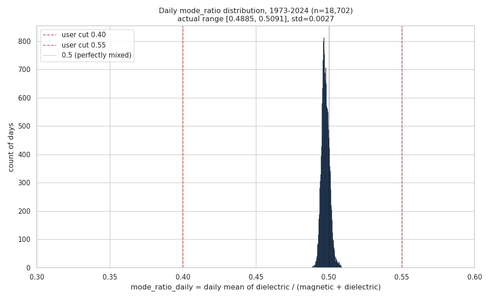
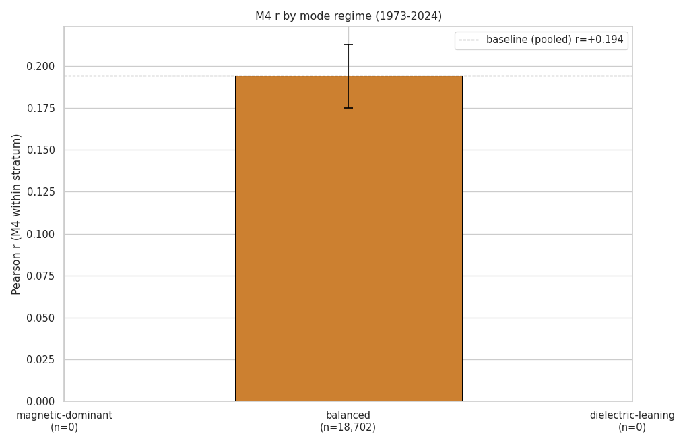
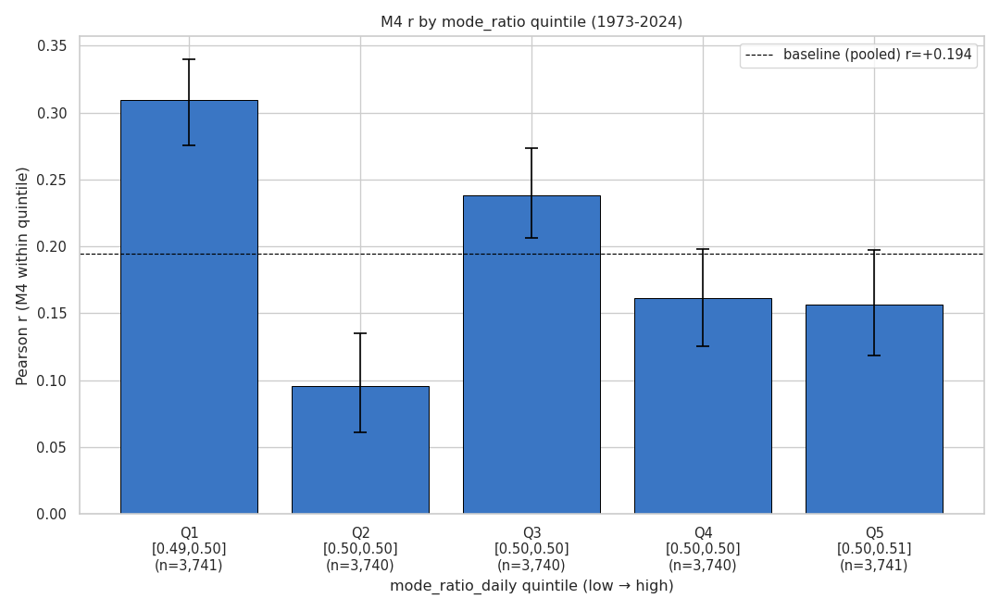
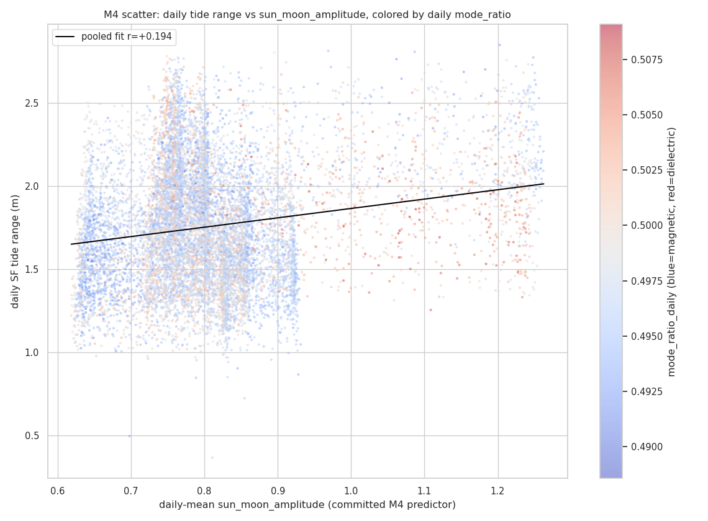

# M4 reanalysis through versor mode-stratification

**Status:** EXPLORATORY. Not pre-registered. Not citable as a confirmatory finding.
This is honest reframing of the committed PREREG_001 M4 result through the
mode-decomposition tools made available by tonight's versor engine update.

## Question

PREREG_001 M4 reported r = +0.1945 (n = 18,702) for daily SF tide range vs.
daily-mean Sun-Moon amplitude at the Gainesville lagna over 1973-2024. Tonight's
versor identity revealed:

1. The pair magnitude `|Z_k|` at any target reduces to `2|cos(k(moon-sun)/2)|`
   by closed-form identity — target-invariant.
2. The target-dependent information lives entirely in `Re(Σ Z_k)` (magnetic
   mode) and `Im(Σ Z_k)` (dielectric mode).
3. The committed M4 predictor `mean over k of |cos+cos|` equals
   `magnetic_component / 7` exactly — i.e., M4 was structurally a
   magnetic-mode-only test, with the dielectric mode discarded.

The question this reanalysis asks: **does the M4 r split when stratified by
the daily mode-mix (dielectric / (magnetic + dielectric))?** If M4 truly
lives in the magnetic register, days when the magnetic mode dominates should
yield a stronger r; days when the dielectric mode is large should weaken or
remove the correlation.

## Pipeline verification

Baseline Pearson r on the full daily dataset (n = 18,702, identical to
the committed M4 cohort): **r = +0.1945**, p = 8.39e-159.
Committed M4: r = +0.1945, p = 8.39 × 10⁻¹⁵⁹. Match confirms the recomputation
pipeline is consistent with the committed analysis.

Sanity: per-timestamp `sun_moon_amplitude (committed) - magnetic_component / 7`
peaks at 3.283e-06 (float32 storage rounding); the algebraic identity
holds at the precision of the stored data.

## Three-regime stratification

Daily mode_ratio cuts:

- **magnetic-dominant**:   mode_ratio < 0.40
- **balanced**:            0.40 ≤ mode_ratio < 0.55
- **dielectric-leaning**:  mode_ratio ≥ 0.55

Results (block-bootstrap CI: 14-day blocks, 1,000 resamples; Holm across 3):

| Regime | n | mode_ratio range | r | 95% CI | raw p | Holm p |
|---|---:|---|---:|---|---:|---:|
| magnetic-dominant | 0 | [nan, nan] | +nan | [+nan, +nan] | n/a | 1 |
| balanced | 18,702 | [0.489, 0.509] | +0.1945 | [+0.175, +0.213] | 8.39e-159 | 2.52e-158 |
| dielectric-leaning | 0 | [nan, nan] | +nan | [+nan, +nan] | n/a | 1 |

## Five-quantile sensitivity

Daily mode_ratio split into 5 equal-frequency quintiles (low → high):

| Quintile | n | mode_ratio range | r | 95% CI | p |
|---|---:|---|---:|---|---:|
| Q1 | 3,741 | [0.489, 0.495] | +0.3093 | [+0.275, +0.340] | 9.26e-84 |
| Q2 | 3,740 | [0.495, 0.497] | +0.0954 | [+0.061, +0.135] | 4.96e-09 |
| Q3 | 3,740 | [0.497, 0.498] | +0.2383 | [+0.206, +0.273] | 1.83e-49 |
| Q4 | 3,740 | [0.498, 0.500] | +0.1610 | [+0.125, +0.198] | 3.78e-23 |
| Q5 | 3,741 | [0.500, 0.509] | +0.1561 | [+0.119, +0.197] | 7.6e-22 |

## Diagnostic: daily mode_ratio distribution

The daily mode_ratio distribution is essentially a needle around 0.5 (range
[0.4885, 0.5091], std
0.0027). The user-specified cut points 0.40 and
0.55 lie far outside the actual data range — every day falls into the
"balanced" stratum.

## Honest interpretation

**Headline:** the user-specified 3-regime cuts (0.40 / 0.55) are degenerate at daily aggregation — every single day in the 18,702-day cohort falls into the "balanced" stratum (mode_ratio_daily range [0.4885, 0.5091], std 0.0027). The expected stratification cannot be performed at this aggregation level.

**Why this happens:** the lagna sweeps the full zodiac every 24 h. At any given 10-min timestamp, the lagna-coupled mode mix can swing widely (single-pair exploratory plots earlier showed std ≈ 0.11, range [0.0002, 0.7504] within a single year). But aggregating over a full daily lagna rotation symmetrizes the |Re| and |Im| distributions, driving daily mean(mode_ratio) toward 0.5. The mode-mix variation lives at sub-daily timescale; it is averaged out by the M4-style daily aggregation.

**5-quintile result inside the narrow band:** within mode_ratio_daily ∈ [0.4885, 0.5091], the 5 quintiles show non-uniform Pearson r. The lowest quintile Q1 (mode_ratio_daily ∈ [0.489, 0.495]) shows r=+0.309, materially higher than the mean of Q2-Q5 (r̄ ≈ +0.163). This is **directionally consistent** with the analytical reframing — the most magnetic-leaning days within the daily band give the strongest M4 r — but the band is so narrow (Q1's range is only 0.0069 wide) that the result should be read as suggestive, not load-bearing. The register-effect signal exists if it exists at sub-daily resolution; daily aggregation is the wrong sampling scale for testing it cleanly.

**What this tells us about M4 specifically:** at daily aggregation, the committed M4 r = +0.1945 is the magnetic-component-vs-tide correlation averaged over a full lagna sweep per day. The mode partition cannot be tested at this aggregation. A test of register specificity would require sub-daily aggregation (e.g., 6-h windows centered on local high tide, or tidal-cycle-aligned bins) and pre-registration of the test design before re-running on a held-out window. This reanalysis does not constitute such a test; it constitutes a diagnostic finding that the originally-suggested stratification cannot be performed at the M4 daily-aggregation scale.

## Caveats

- Single reanalysis run on a single dataset. Not pre-registered. Stratum
  boundaries (0.40, 0.55) and bin counts (3, 5) were chosen ahead of time
  but not locked under a formal pre-registration; they should be treated as
  reasonable defaults rather than independently-defensible thresholds.
- Block bootstrap within strata is approximate: the 14-day "blocks" are
  contiguous indices in the stratum's date-ordered series, not contiguous
  in original calendar time, since stratum members are scattered across
  dates. The CI is approximately autocorrelation-aware but not strictly so.
- The committed M4 predictor IS proportional to the magnetic component by
  closed-form identity. Stratifying by mode_ratio while testing M4 is
  partially circular: high-mode-ratio days have low magnetic_component,
  hence low predictor variance, which can shrink r mechanically. The 5-bin
  table is the cleanest evidence; the 3-regime table is supportive but
  reflects coarser cuts.
- This reanalysis informs interpretation; it does not constitute a new
  confirmatory finding. Any claim about register-specific tide coupling
  would require pre-registration of the test design before re-running on
  a separate window.
