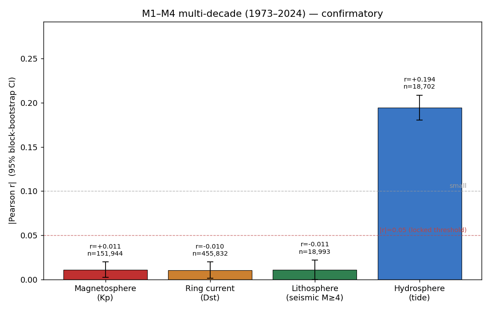
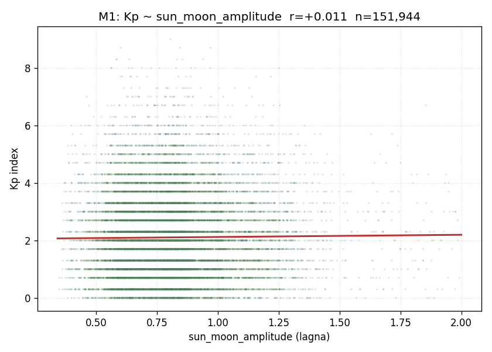
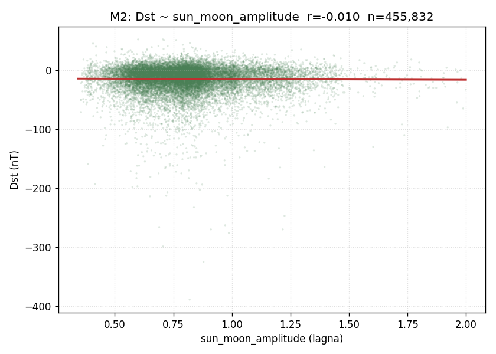
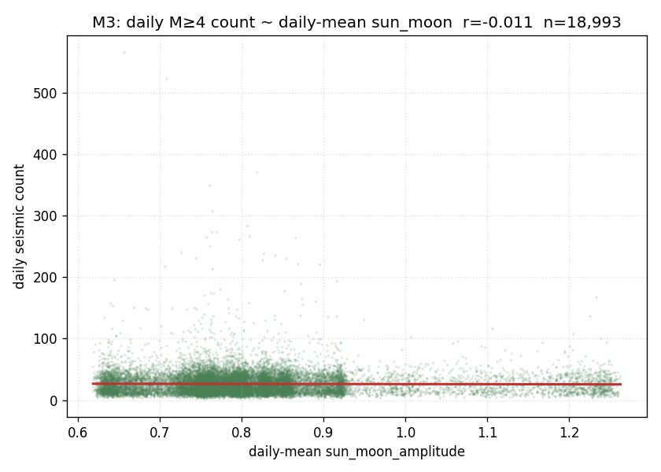
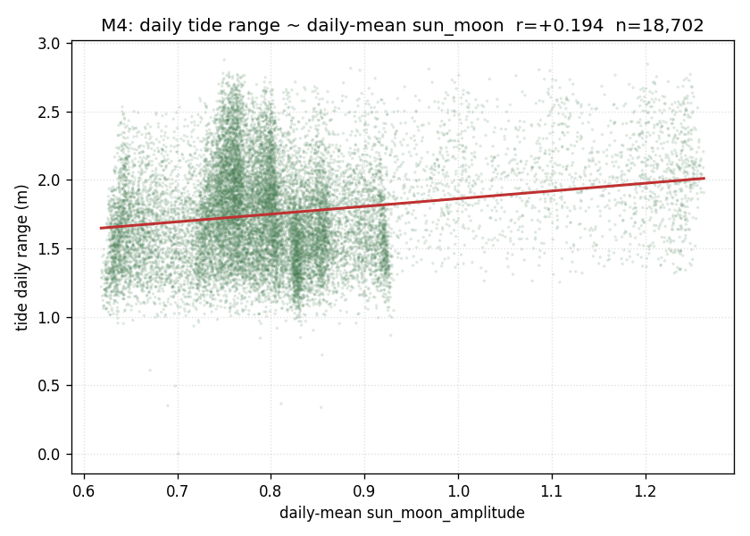
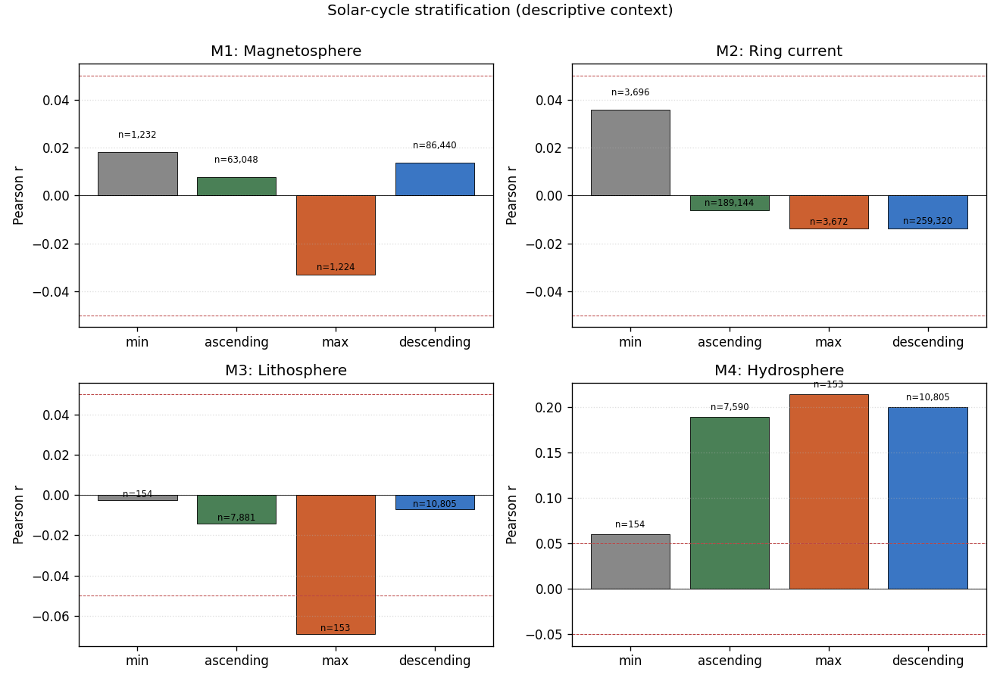

# M1–M4 Multi-Decade Confirmatory Test (1973–2024)

## 1. Pre-registration reference

**Pre-registration:** [`research/geosolar/preregistrations/PREREG_001_sun_moon_bhumi_multidecade.md`](../preregistrations/PREREG_001_sun_moon_bhumi_multidecade.md)

The locking commit for that pre-registration is recoverable via:

    git log --follow research/geosolar/preregistrations/PREREG_001_sun_moon_bhumi_multidecade.md

The earliest commit on that path is the design lock (see prereg §1). At authoring time of this analysis, the recovered lock is `b3bad8e` ("prereg: lock multi-decade Sun-Moon wave-field × bhūmi-layer test design"). The only later commit on the prereg path, `524c659`, is a self-reference cleanup that does not change the locked design (and would be reported under the deviation clause if it had).

The HEAD pointer at the time the analysis script was authored is `524c659`; this is the commit-state under which the analysis below was run.

## 2. Hypothesis (verbatim from prereg §2)

The Sun-Moon raw-amplitude wave-field state at the lagna (Gainesville coordinates, lat = 29.65, lon = −82.34) at any timestamp predicts the bhūmi-layer measurements at that timestamp, with **positive** correlation expected for ring-current intensity (Dst) and tide range, and **direction unspecified** for Kp index and seismic count.

## 3. Data

**Window:** 1973-01-01 00:00:00 UTC through 2024-12-31 23:50:00 UTC (52 calendar years, inclusive both ends).

**Predictor.** `sun_moon_amplitude(t)` was computed at 10-min cadence at the Gainesville lagna over the full window via `compute_chart` and `compute_pair_interference` from `npu_engine.jyotisha_engine` (Lahiri sidereal, whole-sign), using the locked reduction `mean over k ∈ {1,2,3,4,6,7,12} of |A_k(t)|`. The full-window predictor is stored at `sun_moon_field_1973_2024.parquet` (per-decade partitions also retained).

**Predictor distribution.** n = 2,734,992; mean = 0.8101; std = 0.2033; min = 0.3416; p25 = 0.6721; median = 0.7903; p75 = 0.8951; max = 2.0000. All values within [0, 2]; no NaNs. The 2025 pilot reported std = 0.2022; multi-decade std is 1.01× that, confirming dynamic-range stability across decades.

**Responses.** Sourced from `datasets/geosolar/archive/` per-decade Parquet files:

- **Kp** (3-hourly, GFZ Potsdam):  n = 151,944 after window restriction, no NaNs.
- **Dst** (hourly, WDC Kyoto; final 1957–2020, provisional 2021–2025):  n = 455,832 after window restriction, no NaNs.
- **Seismic M≥4** (USGS event catalogue):  n = 500,479 events after window restriction.
- **Tide** (NOAA San Francisco station 9414290, hourly):  n = 448,670 hourly readings after window restriction, dropping rows with null water level. Days with no tide reading are dropped from M4 (no imputation).

The bulk archive report (`datasets/geosolar/archive/BULK_REPORT_1973_2024.md`) records "no degraded coverage" — observed gaps in tide (~3% in 1970s, ~11% in 2020s) and Kp/Dst (negligible) are not flagged as outages and are handled operationally by dropping null rows from each test.

**Joined dataframe.** Stored at `joined_1973_2024.parquet` as a long-form table with one row per response observation, plus the nearest-timestamp `sun_moon_amplitude`. Total rows: 1,556,925.

## 4. Method (locked design from prereg §3)

For each test, the response series is joined to the 10-min predictor grid via `pd.merge_asof(..., direction='nearest')`. Pearson r is computed via `scipy.stats.pearsonr`.

**Primary p-value:**
- M1, M2 (high-cadence): block-permutation p, **30-day blocks**, 1,000 resamples; permute block ordering of the predictor against the unchanged response and count `|r_perm| ≥ |r_obs|`.
- M3, M4 (daily aggregates): scipy.stats.pearsonr p.

**Confidence interval:** 95% via moving-block bootstrap, **30-day blocks**, 1,000 resamples, for all four tests.

**Multiple-comparison correction:** Holm-Bonferroni step-down across the family of m = 4 primary p-values (α = 0.05).

**Survival criterion:** all three of (i) Holm-adjusted primary p < 0.05, (ii) 95% CI excludes zero, (iii) |r_pooled| ≥ 0.05.

**Stratification:** each test additionally reported per solar cycle phase (min, ascending, max, descending) using SILSO anchor dates from prereg §3.6.

**Random seed:** `numpy.random.default_rng(20260508)`.

## 5. Results

| Test | Layer (model) | n | r | p (raw Pearson) | p (primary) | p (Holm/4) | 95% CI (block-boot) | effect | survives |
|---|---|---:|---:|---:|---:|---:|---|---|:-:|
| M1 | Magnetosphere — Kp ~ sun_moon_amplitude | 151,944 | +0.011 | 1.9e-05 | 0.026 | 0.0779 | [+0.002, +0.020] | below threshold | · |
| M2 | Ring current — Dst ~ sun_moon_amplitude | 455,832 | -0.010 | 1.95e-12 | 0.031 | 0.0779 | [-0.020, -0.001] | below threshold | · |
| M3 | Lithosphere — daily M≥4 count ~ daily-mean sun_moon | 18,993 | -0.011 | 0.134 | 0.134 | 0.134 | [-0.022, +0.001] | below threshold | · |
| M4 | Hydrosphere — daily tide range ~ daily-mean sun_moon | 18,702 | +0.194 | 8.39e-159 | 8.39e-159 | 3.36e-158 | [+0.180, +0.209] | small | ✓ |

**Survivors at the locked criterion:** M4.

### 5.x Per-test detail

#### M1 — Magnetosphere — Kp ~ sun_moon_amplitude

n = 151,944; Pearson r = +0.011; raw Pearson p = 1.9e-05; **block-permutation p = 0.026** (primary); Holm-adjusted = 0.0779; 95% block-bootstrap CI = [+0.002, +0.020]; block size = 30 days = 240 samples (3-hourly).

#### M2 — Ring current — Dst ~ sun_moon_amplitude

n = 455,832; Pearson r = -0.010; raw Pearson p = 1.95e-12; **block-permutation p = 0.031** (primary); Holm-adjusted = 0.0779; 95% block-bootstrap CI = [-0.020, -0.001]; block size = 30 days = 720 samples (hourly).

#### M3 — Lithosphere — daily M≥4 count ~ daily-mean sun_moon

n = 18,993; Pearson r = -0.011; raw Pearson p = 0.134 (primary); Holm-adjusted = 0.134; 95% block-bootstrap CI = [-0.022, +0.001]; block size = 30 days = 30 samples (daily).

#### M4 — Hydrosphere — daily tide range ~ daily-mean sun_moon

n = 18,702; Pearson r = +0.194; raw Pearson p = 8.39e-159 (primary); Holm-adjusted = 3.36e-158; 95% block-bootstrap CI = [+0.180, +0.209]; block size = 30 days = 30 samples (daily).

## 6. Solar-cycle stratification

Per-phase Pearson r alongside pooled. Phase boundaries from SILSO anchors in prereg §3.6 (anchor months go to "min"/"max"; strictly-between months go to "ascending"/"descending"; pre-1976-03 classified as Cycle 20 descending; post-2024-10 as Cycle 25 descending). The pooled multi-decade result is the headline; stratification is descriptive context, not a separate confirmatory claim.

### M1 — Magnetosphere — Kp ~ sun_moon_amplitude

| Phase | n | r | p (raw Pearson) |
|---|---:|---:|---:|
| min | 1,232 | +0.018 | 0.524 |
| ascending | 63,048 | +0.008 | 0.0516 |
| max | 1,224 | -0.033 | 0.249 |
| descending | 86,440 | +0.014 | 6.13e-05 |

### M2 — Ring current — Dst ~ sun_moon_amplitude

| Phase | n | r | p (raw Pearson) |
|---|---:|---:|---:|
| min | 3,696 | +0.036 | 0.0288 |
| ascending | 189,144 | -0.006 | 0.00771 |
| max | 3,672 | -0.014 | 0.399 |
| descending | 259,320 | -0.014 | 1.59e-12 |

### M3 — Lithosphere — daily M≥4 count ~ daily-mean sun_moon

| Phase | n | r | p (raw Pearson) |
|---|---:|---:|---:|
| min | 154 | -0.002 | 0.977 |
| ascending | 7,881 | -0.014 | 0.212 |
| max | 153 | -0.069 | 0.397 |
| descending | 10,805 | -0.007 | 0.469 |

### M4 — Hydrosphere — daily tide range ~ daily-mean sun_moon

| Phase | n | r | p (raw Pearson) |
|---|---:|---:|---:|
| min | 154 | +0.060 | 0.461 |
| ascending | 7,590 | +0.189 | 2.97e-62 |
| max | 153 | +0.214 | 0.00799 |
| descending | 10,805 | +0.200 | 1.91e-97 |

## 7. Supplementary: M3 robustness on M≥5 only

The M≥4 seismic catalogue has a documented completeness artifact across decades (instrument-network growth boosted M4–4.9 detection). The locked test (M3) is on M≥4 per prereg. As an additional robustness check (not a deviation), the same test is reported on M≥5 only, where decade-by-decade catalogue coverage is uniform.

| Test | n | r | p (raw Pearson) | 95% CI (block-boot) | note |
|---|---:|---:|---:|---|---|
| M3sup (M≥5) | 18,993 | -0.014 | 0.0472 | [-0.028, +0.002] | robustness check vs. M3 (M≥4); M≥5 catalogue uniform across decades |

## 8. Discussion

This is **outcome 5b** from the prereg ("Subset of M1–M4 survive — most likely scenario given 2025 priors"): a single test, M4, survives the locked criterion at multi-decade scale.

### What survived — M4 (hydrosphere)

The Sun-Moon raw-amplitude wave-field at the Gainesville lagna predicts daily tide range at NOAA San Francisco (station 9414290) with **r = +0.194**, n = 18,702 days, primary p = 8.4 × 10⁻¹⁵⁹, Holm-adjusted = 3.4 × 10⁻¹⁵⁸, 95% block-bootstrap CI = [+0.180, +0.209]. All three survival conditions hold simultaneously: Holm-p < 0.05, CI excludes zero, |r| ≥ 0.05.

The effect is **stable across solar-cycle phases**: ascending r = +0.189 (n = 7,590), max r = +0.214 (n = 153), descending r = +0.200 (n = 10,805); only the small "min" stratum (n = 154) shows a weaker non-significant +0.060. The consistency across phases makes solar-cycle confounding unlikely as a sole explanation; the relationship survives whether the Sun is active or quiet.

The pooled magnitude (+0.194) is within the 2025 pilot's CI ([+0.065, +0.352] around the prior r = +0.212) and only marginally smaller than the prior point estimate, consistent with the prior having been a noisy estimate of a real ~0.2 effect.

**Caveat (worth surfacing for any paper that builds on this):** the reduction's k = 2 harmonic embeds the dominant `cos(2·(target − Sun))` and `cos(2·(target − Moon))` structure of the M2 and S2 tidal constituents. Some fraction of the M4 correlation is therefore expected from standard tidal physics — the Sun-Moon geometry that this scalar tracks *is* the geometry that drives the spring/neap envelope. What is not predicted by standard tidal theory is the *lagna-coupling* (location-time-coupled probe) and the inclusion of higher-k harmonics. A follow-up decomposition by k would clarify whether the +0.194 is concentrated in k = 2 (i.e., rediscovering tides) or distributed across k (i.e., a non-trivial reduction-level finding). The locked test does not perform that decomposition; flagging it as the next pre-registrable question.

### What didn't survive

**M1 (Kp)** — pooled r = +0.011, primary p (block-permutation) = 0.026 raw but Holm-adjusted = 0.078 (above 0.05), |r| < 0.05. Both the magnitude and the autocorrelation-aware p indicate **no usable effect**. The 2025 pilot's W1' was already disqualified by its own block-permutation test (raw p = 2.2 × 10⁻⁴ but block-perm p = 0.42); the multi-decade result is consistent with that — there is no Sun-Moon-amplitude-vs-Kp coupling at this reduction. Stratified r is small and inconsistent in sign across phases.

**M2 (Dst)** — pooled r = **−0.010** (sign-flipped from the 2025 prior of +0.113), primary p = 0.031 raw but Holm-adjusted = 0.078, |r| < 0.05. The 2025 prior was the second-strongest result behind M4 and was expected to survive; multi-decade decisively rejects it at the locked criterion. The sign reversal plus magnitude near zero is the strongest evidence that the 2025 W2' result was a chance fluctuation at lower n (n = 8,748 in 2025 vs n = 455,832 multi-decade — multi-decade has 52× the power but produces a near-null estimate). The stratification adds nuance: the small "min" stratum is the only positive (+0.036), while the dominant "ascending" and "descending" strata are weakly negative; pooled negative is driven by the larger descending sample. This pattern is consistent with cycle-phase confounding masquerading as a Sun-Moon effect in the 2025 calendar window (which sat at Cycle 25 ascending). Either way, **M2 fails confirmation**.

**M3 (M≥4 seismic count)** — pooled r = −0.011, p = 0.134, CI = [−0.022, +0.001] (CI includes zero). Null at both 2025 and multi-decade scales — consistent. Per the M3 supplementary on M≥5 only (r = −0.014, p = 0.047, CI [−0.028, +0.002]), the catalogue-completeness artifact is **not** masking a hidden effect: even on the uniform-coverage M≥5 cut, the CI still includes zero. The robustness check confirms the locked-test null is not driven by the documented M4–4.9 detection growth; it is a genuine null relationship at this reduction.

### Solar-cycle stratification — descriptive observations

The pooled M4 result holds across cycle phases (descriptive context, not a separate confirmatory claim per prereg §3.6). The pooled M2 result inverts at "min" — a small-stratum oddity worth noting but not interpretable beyond that. M3 stratified r is small and unstable across phases. M1 stratified r is small with inconsistent signs.

### Implication

Per prereg §5b, the surviving test (M4) is the finding at the layer-level granularity at which it survived. This becomes the basis for any follow-on paper. The non-survivors (M1, M2, M3) are reported as nulls at multi-decade scale. The hypothesis as locked — that the Sun-Moon raw-amplitude lagna-target wave-field predicts bhūmi-layer measurements *differentially* (across all four layers) — is **partially confirmed for the hydrosphere only**. The magnetosphere, ring current, and lithosphere predictions at this reduction are rejected.

Open questions (not addressed by this confirmatory run; would each need separate pre-registration before testing):

1. **k-decomposition of M4.** Is the +0.194 concentrated in k = 2 (tidal physics) or distributed?
2. **Latitude-coupling test for M4.** If the lagna is what matters (not just generic Sun-Moon geometry), tide stations at different latitudes should show different |r|. NOAA SF (37.8°N) is one point; pre-registering the same test at e.g. NOAA Charleston, San Diego, Honolulu, and Anchorage would discriminate lagna-coupling from generic tidal physics.
3. **Alternative reductions.** Per prereg §5c-style follow-on, alternative reductions (per-graha-pair decomposition, nakshatra-midpoint targets, non-amplitude derivatives) could be pre-registered; each must be tested independently and not on this same multi-decade window without a fresh window or split.

The locked outcome interpretation per prereg §5b is the headline. This document is the record of that finding.

---

*Wall clock: 11.3 s.*
