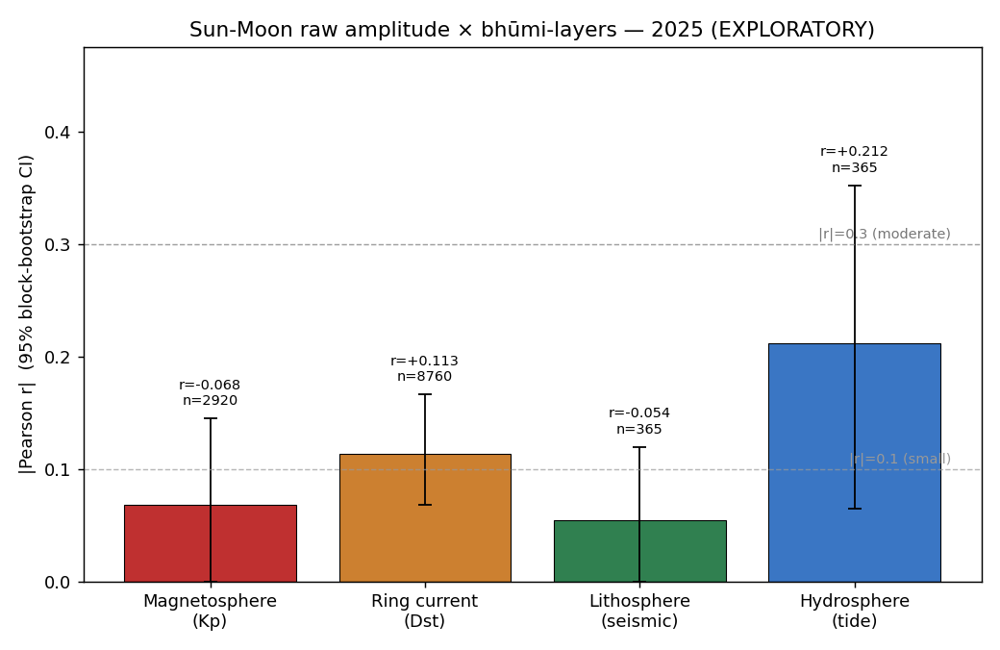
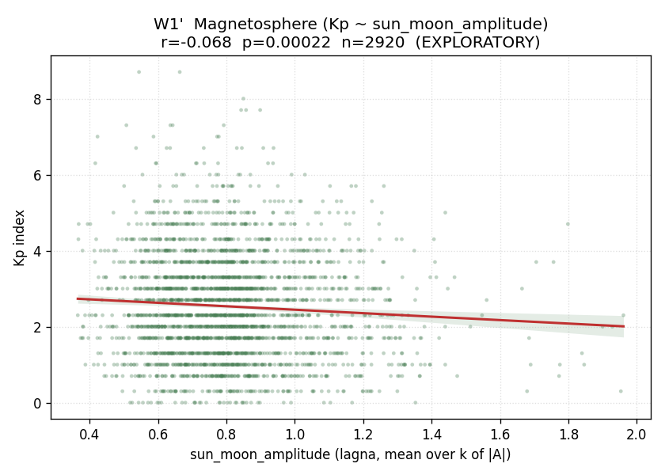
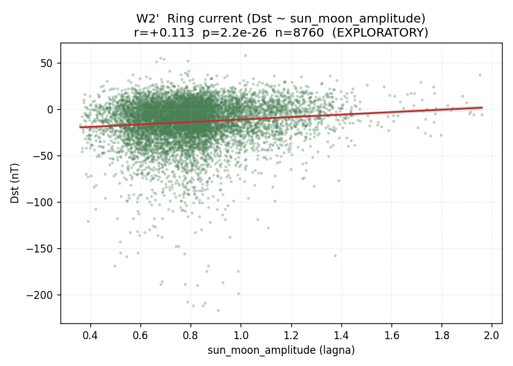
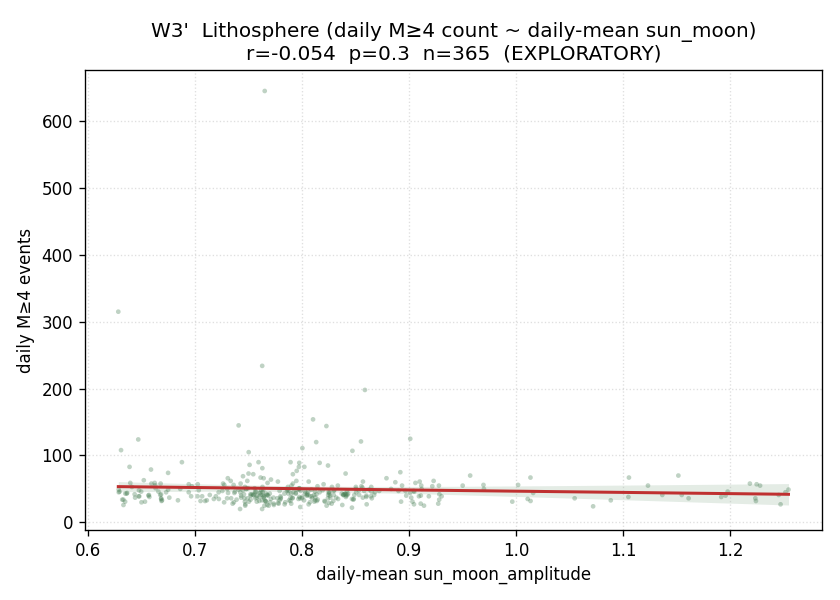
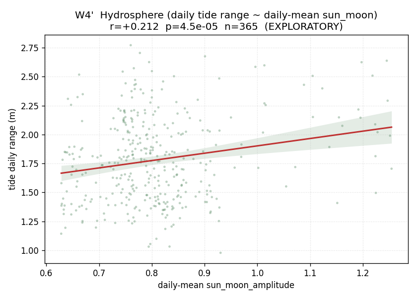

# Sun-Moon Raw-Amplitude Wave-Field × Bhūmi-Layers — 2025 (EXPLORATORY)

This analysis is EXPLORATORY. It was run after the pre-specified zodiacal-mean wave-field test (research/geosolar/pilot_2025/WAVE_FIELD_ANALYSIS_2025.md) returned a clean null. The choice to drop the per-k normalization and to lock the target to the lagna was made AFTER seeing that null, informed by diagnostic evidence that the normalization compressed variance below detectable levels. Any signal surfaced here cannot be claimed as a confirmatory finding from 2025 data; it can only motivate pre-specification of the same test on the forthcoming multi-decade dataset (1973–2024), where statistical power is higher and the test is run on data not seen at design time.

## Hypothesis

The original wave-field-mean scalar applied a per-k min-max normalization across twelve zodiacal targets at every timestamp; this collapsed dynamic range to std ≈ 0.032 over a year. The two-step modification tested here:

1. **Drop the normalization.** Use raw `|A_k| = |cos(k·(target − Sun)) + cos(k·(target − Moon))|` instead of the rank-rescaled composite.
2. **Lock the target to the lagna** (rising point at Gainesville, lat = 29.65, lon = −82.34). The lagna sweeps through the zodiac roughly every 24 hours due to Earth rotation, providing a location-coupled, time-varying probe that the static zodiacal-centroid set lacks.

The reduction is `sun_moon_amplitude(t) = mean over k ∈ {1,2,3,4,6,7,12} of |A_k(t)|`, range [0, 2]. The hypothesis: this reduction better preserves the variance pattern that should — under the substrate-stratification framing — couple to bhūmi-layer responses (Kp, Dst, daily seismic count, daily tide range).

## Method

For each of the 52,560 ten-minute timestamps in 2025, `compute_chart(dt_utc, lat=29.65, lon=-82.34)` returns Sun, Moon, and lagna sidereal longitudes (Lahiri ayanāṃśa). For each k in {1,2,3,4,6,7,12}, `compute_pair_interference(sun_long, moon_long, lagna_long, k)` from `npu_engine.jyotisha_engine` returns the raw amplitude `A_k`. The scalar is the arithmetic mean over k of `|A_k|`. The full per-timestamp scalar plus the three input longitudes is stored as `sun_moon_field_2025.parquet`.

The four-test family W1'..W4' mirrors the prior W1..W4 exactly, with `wave_field_mean` swapped for `sun_moon_amplitude`:

  - **W1'** Kp vs `sun_moon_amplitude` (3-hourly, n = 2,920)
  - **W2'** Dst vs `sun_moon_amplitude` (hourly, n = 8,760)
  - **W3'** Daily M≥4 seismic count vs daily-mean `sun_moon_amplitude` (n = 365)
  - **W4'** Daily tide range vs daily-mean `sun_moon_amplitude` (n = 365)

Holm-Bonferroni step-down across the new family of four (separate from the prior null family). 95% confidence intervals via moving-block bootstrap, 1,000 resamples; block size = 30 days for hourly/3-hourly, 14 days for daily aggregates. For W1' specifically, an additional autocorrelation-aware block-permutation p-value is reported (block size = 30 days).

**Distribution of the scalar.** n = 52,560; mean = 0.8089; std = 0.2022; min = 0.3430; p25 = 0.6717; median = 0.7899; p75 = 0.8938; max = 1.9981. All values lie in [0, 2]; no NaNs. Dynamic range is **6.2× wider** than the prior wave-field-mean (std = 0.0325).

## Results

| Test | Layer (model) | n | r | p (raw) | p (Holm/4) | 95% CI (block-boot) | p (block-perm) | effect |
|---|---|---:|---:|---:|---:|---|---:|---|
| W1' | Magnetosphere (Kp ~ sun_moon_amplitude) | 2920 | -0.068 | 0.00022 | 0.00045 | [-0.145, +0.019] | 0.42 | negligible |
| W2' | Ring current (Dst ~ sun_moon_amplitude) | 8760 | +0.113 | 2.2e-26 | 8.9e-26 | [+0.068, +0.166] | — | small |
| W3' | Lithosphere (daily M≥4 count ~ daily-mean sun_moon) | 365 | -0.054 | 0.3 | 0.3 | [-0.120, +0.034] | — | negligible |
| W4' | Hydrosphere (daily tide range ~ daily-mean sun_moon) | 365 | +0.212 | 4.5e-05 | 0.00014 | [+0.065, +0.352] | — | small |

Strongest absolute correlation: **W4'** (|r| = 0.212). Tests with |r| ≥ 0.1 (above the negligible threshold): W2', W4'. Tests surviving Holm correction at α = 0.05: W1', W2', W4'.

## Per-test detail

### W1' — Magnetosphere (Kp ~ sun_moon_amplitude)

n = 2920; Pearson r = -0.068; raw p = 0.00022; Holm-adjusted p = 0.00045; 95% block-bootstrap CI = [-0.145, +0.019] (block size = 30 days = 240 samples). Block-permutation p (autocorrelation-aware) = 0.42. Effect size: **negligible** (EXPLORATORY).

### W2' — Ring current (Dst ~ sun_moon_amplitude)

n = 8760; Pearson r = +0.113; raw p = 2.2e-26; Holm-adjusted p = 8.9e-26; 95% block-bootstrap CI = [+0.068, +0.166] (block size = 30 days = 720 samples). Effect size: **small** (EXPLORATORY).

### W3' — Lithosphere (daily M≥4 count ~ daily-mean sun_moon)

n = 365; Pearson r = -0.054; raw p = 0.3; Holm-adjusted p = 0.3; 95% block-bootstrap CI = [-0.120, +0.034] (block size = 14 days = 14 samples). Effect size: **negligible** (EXPLORATORY).

### W4' — Hydrosphere (daily tide range ~ daily-mean sun_moon)

n = 365; Pearson r = +0.212; raw p = 4.5e-05; Holm-adjusted p = 0.00014; 95% block-bootstrap CI = [+0.065, +0.352] (block size = 14 days = 14 samples). Effect size: **small** (EXPLORATORY).

## Limitations

- **EXPLORATORY.** The reduction (drop normalization + lock to lagna) was chosen after seeing the prior null. Type-I error is uncontrolled even after Holm correction within this family, because *the family itself was selected post-hoc*.
- **Single year.** 2025 only; no out-of-sample replication.
- **Single location.** The lagna is computed at Gainesville. A different latitude shifts the rising point ordering and would re-time the scalar.
- **Single pair (Sun-Moon).** Other dyads (Sun-Saturn, Moon-Jupiter, etc.) are not tested here. The Sun-Moon choice is physically motivated for tides and lunar-syzygy seismic, less so for Kp/Dst.
- **Daily aggregation for W3'/W4'.** Sub-daily structure is collapsed; coupling on shorter timescales (e.g. tidal-syzygy peaks within a day) is invisible to this aggregation.
- **Autocorrelation handling is approximate.** Block bootstrap captures within-block dependence but assumes block-level exchangeability.

## Confirmatory next step

This 2025 result, regardless of its magnitude, **is not citable as a finding**. The actual confirmatory test on the Sun-Moon raw-amplitude lagna-target hypothesis will be run on the forthcoming multi-decade dataset (1973–2024 archive currently being assembled). The pre-specification will:

1. Lock the test design — same `sun_moon_amplitude` reduction, same lagna location (Gainesville), same four bhūmi-layer indicators, same Holm-across-4, same block-bootstrap CI rules — **before** the multi-decade data is loaded for analysis.
2. Be committed to git with a timestamp, so the lock is auditable.
3. Be evaluated on the multi-decade data exactly once. Whatever it shows is the result on this hypothesis. No re-tuning, no re-reduction, no re-pick of target.

The 2025 numbers in this report function only as a power-and-scale prior for that pre-registered multi-decade test. They do not establish or refute the substrate-stratification claim.

---

*Inputs: `compute_chart` + `compute_pair_interference` from `npu_engine.jyotisha_engine` (pure ephemeris). Wall clock for analysis: 0.7 s.*
