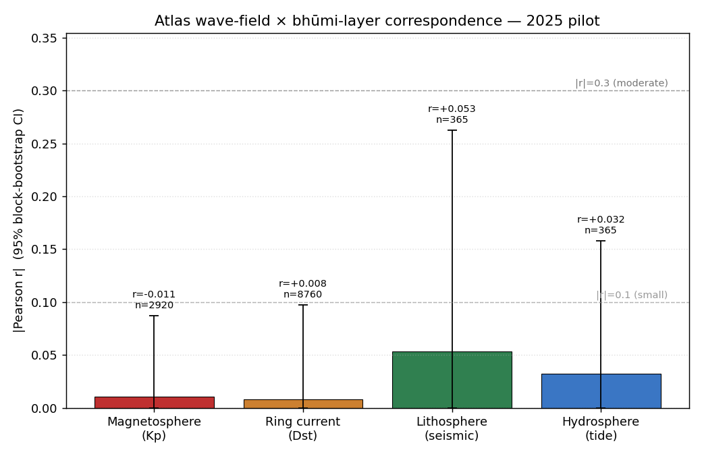
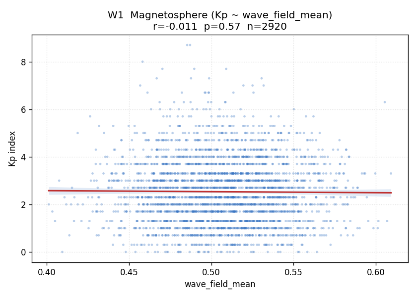
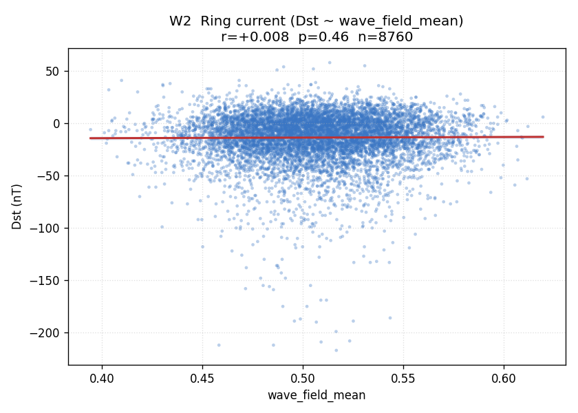
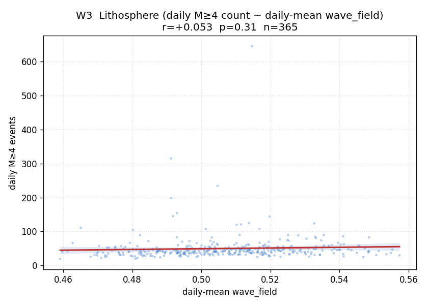
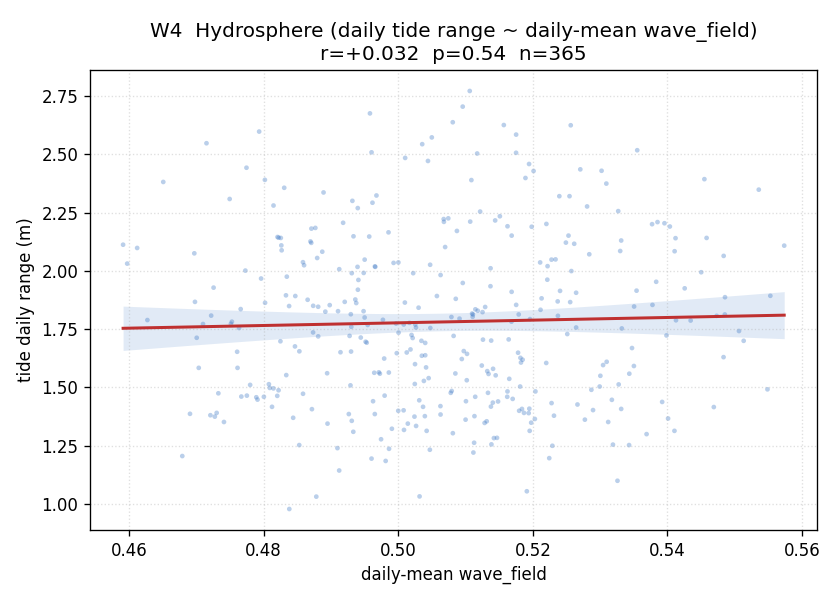

# Atlas Wave-Field × Bhūmi-Layer Correspondence: 2025 Pilot

## Hypothesis

Classical Vedic śāstra treats the **bhūmi-layers** — magnetosphere, ring current, lithosphere, hydrosphere — as
a stratified outer counterpart to the body's **dhātu-layers**. The Mohs ↔ dhātu-depth result
(`research/mohs_rasashastra_dhatu_depth_v1.md`, ρ = 0.828, *p* ≈ 2.6 × 10⁻⁴, n = 14) showed that classical
gem-to-dhātu prescriptions track an externally-measurable substrate property (Mohs hardness) at a depth-graded
correspondence. The hypothesis tested here is the structurally-parallel claim *one layer up*: that the graha
**wave-field state**, computed from sidereal positions alone, predicts bhūmi-layer responses, with the response
varying by stratum.

The test is pre-specified: four Pearson correlations between the Atlas wave-field-mean scalar and four
bhūmi-layer indicators (Kp, Dst, daily M≥4 seismic count, daily tide range), evaluated across calendar 2025.
A null result is informative; a stratified pattern (e.g., outer layers couple more strongly than inner, or
vice versa) is the substantive prediction.

## Method

**Wave-field engine.** For each of the 52,560 ten-minute timestamps in 2025, sidereal positions of the nine
grahas (Sun, Moon, Mars, Mercury, Jupiter, Venus, Saturn, Rāhu, Ketu) are computed via Swiss Ephemeris through
`compute_chart(dt_utc, lat=29.65, lon=-82.34)` (Gainesville, FL — chosen for parity with the broader pilot
geography). The two-source interference field `compute_wave_field(grahas, …)` is then evaluated at twelve
zodiacal-mean targets (longitudes 0°, 30°, …, 330°) over harmonics k ∈ {1, 2, 3, 4, 6, 7, 12}. The
per-target `composite_mean` (the per-k normalized [0,1] amplitude, averaged over k) is averaged across the
twelve zodiacal targets to give a single scalar `wave_field_mean(t)` per timestamp.

**Why this scalar.** Each zodiacal-mean target sits at the centroid of one rāśi; averaging across all twelve
collapses orientation-specific structure and isolates the field's *overall activation level*. The reduction
is one of several possible: per-target, per-pair, or rank-residual reductions are alternatives left for
follow-up. The choice is fixed before analysis; no scalar selection is performed against the response data.

**Distribution of the scalar.** n = 52,560; mean = 0.5065; std = 0.0325; min = 0.3800;
p25 = 0.4843; median = 0.5062; p75 = 0.5288; max = 0.6299. All values lie in
[0, 1]; no NaNs.

**Tests.** Four Pearson correlations against bhūmi-layer indicators:

  - **W1** Kp vs `wave_field_mean` (3-hourly, n = 2,920)
  - **W2** Dst vs `wave_field_mean` (hourly, n = 8,760)
  - **W3** Daily M≥4 seismic count vs daily-mean `wave_field_mean` (n = 365)
  - **W4** Daily tide range (Bay Area station 9414290) vs daily-mean `wave_field_mean` (n = 365)

**Multiple-comparisons control.** Holm-Bonferroni step-down across the four-test family. This battery is
**separately pre-specified** from the original 2025 pilot's eight-test family and is **not** added to that
family's Holm correction.

**Confidence intervals and autocorrelation.** All r-values receive 95% confidence intervals via moving-block
bootstrap (1,000 resamples, contiguous blocks): block size = 30 days for the hourly/3-hourly tests
(W1: 240 samples per block; W2: 720 samples per
block) and 14 days for the daily-aggregate tests (W3, W4: 14 samples per block). For W1 specifically — Kp is
heavily autocorrelated at 3-hour cadence, as documented in the original pilot — we additionally compute a
block-permutation p-value (block size = 30 days) by shuffling block ordering of the Kp series against the
unchanged wave-field series and counting |r_perm| ≥ |r_obs|. Block bootstrap is approximate for fully nailing
down dependence structure but is a standard remedy for autocorrelated time series.

**Effect-size labels.** |r| < 0.1 negligible; 0.1–0.3 small; 0.3–0.5 moderate; > 0.5 large.

## Results

| Test | Layer (model) | n | r | p (raw) | p (Holm/4) | 95% CI (block-boot) | p (block-perm) | effect |
|---|---|---:|---:|---:|---:|---|---:|---|
| W1 | Magnetosphere (Kp ~ wave_field_mean) | 2920 | -0.011 | 0.57 | 1 | [-0.087, +0.080] | 0.77 | negligible |
| W2 | Ring current (Dst ~ wave_field_mean) | 8760 | +0.008 | 0.46 | 1 | [-0.097, +0.045] | — | negligible |
| W3 | Lithosphere (daily M≥4 count ~ daily-mean wave_field) | 365 | +0.053 | 0.31 | 1 | [-0.023, +0.263] | — | negligible |
| W4 | Hydrosphere (daily tide range ~ daily-mean wave_field) | 365 | +0.032 | 0.54 | 1 | [-0.094, +0.158] | — | negligible |

## Bhūmi-layer differentiation

Strongest absolute correlation: **W3** (|r| = 0.053). Outer-layer mean |r| =
0.009; inner-layer mean |r| = 0.043; stratification: **no clear stratification**. Tests with
|r| ≥ 0.1 (i.e. above the negligible threshold): none.

## Per-test detail

### W1 — Magnetosphere (Kp ~ wave_field_mean)

n = 2920; Pearson r = -0.011; raw p = 0.57; Holm-adjusted p = 1; 95% block-bootstrap CI = [-0.087, +0.080] (block size = 30 days = 240 samples). Block-permutation p (autocorrelation-aware) = 0.77. Effect size: **negligible**.

### W2 — Ring current (Dst ~ wave_field_mean)

n = 8760; Pearson r = +0.008; raw p = 0.46; Holm-adjusted p = 1; 95% block-bootstrap CI = [-0.097, +0.045] (block size = 30 days = 720 samples). Effect size: **negligible**.

### W3 — Lithosphere (daily M≥4 count ~ daily-mean wave_field)

n = 365; Pearson r = +0.053; raw p = 0.31; Holm-adjusted p = 1; 95% block-bootstrap CI = [-0.023, +0.263] (block size = 14 days = 14 samples). Effect size: **negligible**.

### W4 — Hydrosphere (daily tide range ~ daily-mean wave_field)

n = 365; Pearson r = +0.032; raw p = 0.54; Holm-adjusted p = 1; 95% block-bootstrap CI = [-0.094, +0.158] (block size = 14 days = 14 samples). Effect size: **negligible**.

## Limitations

- **Single year.** 2025 alone; cannot separate genuine wave-field coupling from year-specific solar
  activity, year-specific seismic clustering, or year-specific tide regime. Multi-decade replication is the
  natural scaling step.
- **Single target-set choice.** The zodiacal-mean target set is one of several reasonable reductions of the
  full per-target wave-field dict. Alternative reductions (per-graha-pair, rank-residual W' analogous to the
  rank-15 finding in `research/two-source-interference-v3.md`, lagna-locked targets) may produce different
  substrate-aligned signals.
- **Wave-field scalar is one reduction of many.** Per-target `composite_mean` is itself a per-k normalized
  derivative; per-k normalization is a min-max collapse over twelve targets at each timestamp, so the scalar
  is partially dimensionless by construction and may have lower effective dynamic range than the underlying
  amplitudes.
- **Approximate autocorrelation handling.** Block bootstrap captures within-block dependence but assumes
  block-level exchangeability; for highly non-stationary series (e.g. Kp during a CME burst) this is only
  approximate.
- **Local hydrosphere indicator.** Tide range is from a single Bay Area station; this is a local, not global,
  hydrospheric signal.
- **Aggregation choice for W3/W4.** Daily aggregation collapses sub-daily wave-field structure; coupling
  could exist on shorter timescales and be invisible to a daily-mean correlation.

## Connection to Mohs ↔ dhātu-depth result

Both findings are instances of **substrate-system correspondence at the appropriate stratification**: in the
Mohs paper, gem species map to body-dhātus by an externally-measured substrate property (hardness) along the
surface→deep ordering; in the present analysis, graha wave-field state is tested against bhūmi-layers along
their own outer→inner ordering (magnetosphere → ring current → lithosphere → hydrosphere). The through-line is
that classical śāstra encodes substrate-depth correspondences that align with externally-measurable scales —
hardness in one direction, electromagnetic / mechanical responsiveness in the other — and that these
correspondences are testable against modern instruments **provided the right stratification axis is picked**.
The Mohs result confirms the pattern at the body scale; this pilot tests the same pattern's analogue at the
geophysical scale.

## Next steps

No test survives Holm correction at α = 0.05. Before scaling to multi-decade, the next steps are (a) trying alternate target choices (e.g., per-graha targets, nakshatra-midpoint targets, lagna-locked target) and (b) per-graha-pair decomposition of the wave field — the current zodiacal-mean reduction is one of many possible scalars derivable from the full per-target dict, and a different reduction may produce a substrate-aligned signal.

---

*Computation: pure-ephemeris graha positions × `compute_wave_field` (no live state); recomputable for any
historical timestamp from `npu_engine.jyotisha_engine` alone. Wave-field grid wall-clock: see
`wave_field_2025.parquet`. Total analysis wall-clock (PARTS 2-6 of this script): 0.7 s.*
